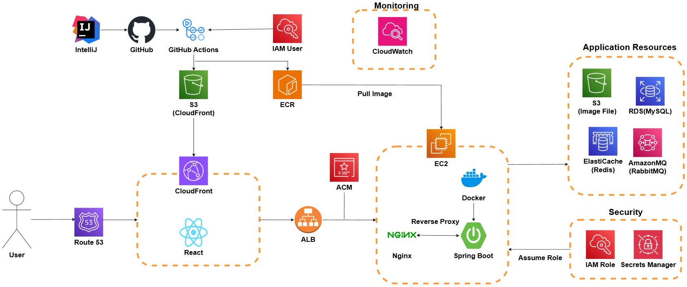
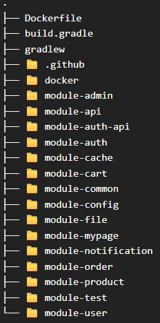
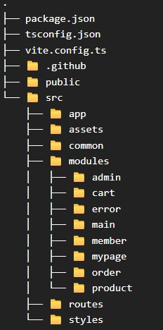

# Man's Shop Multi-module

<br/>
<br/>

## 프로젝트 개요

### 프로젝트 목적
- 하나의 서비스 애플리케이션을 직접 구현하고 운영 환경 수준까지 고도화하는 경험
- 운영 환경을 고려한 설계 원칙 수립 및 기술 선택 경험 확보
- 모듈 분리 기반 구조 설계 및 확장 경험
- Clean Architecture 기반의 계층 구조 명확화 및 공통 로직 재사용 극대화
- 효율적인 테스트 구조 설계(Unit, Integration, E2E)

<br/>

### 프로젝트 요약
이 프로젝트는 소규모 의류 쇼핑몰 서비스를 기획해 직접 구현하고,   
여러 기술 스택과 아키텍처를 적용하며 지속적으로 고도화한 개인 프로젝트입니다.

#### 1. 초기 버전 - JSP 기반 단일 구조
- JDK 8 / Spring MVC / MyBatis / Oracle / JSP
- 가장 기본적인 Monolithic SSR 구조로 시작

#### 2. 개선 버전 - Single-Module Monolithic
- JDK 17 / Spring Boot 3.2.5 / MySQL / React(JSX)
- Backend와 Frontend 통합 빌드 환경
- 유지보수성과 기능 확장을 고려해 개편

#### 3. 현재 버전 - Modular Monolithic 구조로 재구현
- 기존 Single-Module Monolithic을 모듈 단위로 분리
- React(TSX) 기반으로 Frontend를 재구현하며 Backend와의 독립적 환경 구성
- Clean Architecture 기반의 UseCase 중심 구조로 지속적인 개선 및 리팩토링 진행 중

#### 4. 전체 버전 관리 상태
- JSP 버전 및 Single-Module 버전은 완료 후 유지
- Modular Monolithic 버전은 현재도 지속적으로 개선 및 리팩토링 진행 중

### 각 버전 GitHub Repository
- **[🔗 JSP 버전 Git Repo](https://github.com/Youndae/mansShop)**
- **[🔗 Single-Module Monolithic 버전 Git Repo](https://github.com/Youndae/mansshop_boot)**

<br/>
<br/>

## 목차
<strong>1. [개발 환경](#개발-환경)</strong>   
<strong>2. [System Architecture](#system-architecture)</strong>   
<strong>3. [설계 규칙](#설계-규칙)</strong>   
<strong>4. [모듈 구조](#모듈-구조)</strong>   
<strong>5. [기능 목록](#기능-목록)</strong>   
<strong>6. [핵심 기능](#핵심-기능)</strong>   
<strong>7. [테스트 구성](#테스트-구성)</strong>   
<strong>8. [실행 방법](#실행-방법)</strong>

<br/>
<br/>

## 개발 환경
|Category| Tech Stack|
|---|---|
|Backend| - JDK 17 <br/> - Spring Boot 3.4.0 <br/> - Spring Security <br/> - Spring Data JPA <br/> - QueryDSL <br/> - Flyway (DB Migration) <br/> - JWT <br/> - OAuth2 <br/> - Swagger(OpenAPI 3) <br/> - Java Mail <br/> - I'mport 결제 API |
|Frontend| - TypeScript <br/> - React <br/> - Vite <br/> - Redux Toolkit <br/> - React Router <br/> - styled-components <br/> - Axios <br/> - Daum 우편번호 서비스 API|
|Database| - MySQL|
|Cache / Messaging| - Redis <br/> - RabbitMQ|
|DevOps / CI/CD| - Docker <br/> - Docker Compose <br/> - GitHub Actions <br/> - mailHog|
|Tools / IDE| - IntelliJ IDEA <br/> - GitHub <br/> - awaitility|

<br/>
<br/>

## System Architecture



<br/>

### 1. Infrastructure Overview
AWS 기반으로 Frontend와 Backend를 분리 배포한 구조입니다.   
정적 콘텐츠는 S3, CloudFront를 통해 제공하고, Backend는 Docker Container로 EC2에서 실행되도록 구성했습니다.   
데이터, 캐시, 메시징은 모두 독립된 AWS 리소스로 구성해 운영 환경과 동일한 아키텍처를 갖습니다.

#### Application Layer
- **ALB**
    - HTTPS 종료 지점으로 동작하며, Backend 트래픽을 EC2(Nginx)로 라우팅합니다.
- **EC2 + Docker + Nginx**
    - Spring Boot 애플리케이션을 컨테이너 기반으로 실행하고 Reverse Proxy를 통한 안정적인 라우팅을 구성했습니다.
- **React + S3 + CloudFront**
    - 정적 웹 리소스는 S3에 업로드 후 CloudFront CDN을 통해 전달합니다.

#### Data / Messaging Layer
- **RDS(MySQL)** - 트랜잭션 데이터 저장
- **ElastiCache(Redis)** - 인증 / 캐싱 / 임시 데이터 처리
- **AmazonMQ(RabbitMQ)** - 비동기 처리 및 메시징 책임

#### Storage
- **S3 (Image File Storage)** - 상품 이미지 저장

#### Security / IAM
- IAM Role 기반 권한 최소화 적용
- AWS Secrets Manager로 민감 정보 관리

#### Monitoring
- CloudWatch Logs & Metrics
    - 주요 AWS Resource의 기본 Logs 및 Metrics를 통해 서비스 상태와 주요 동작을 모니터링 하도록 구성했습니다.   
      각 리소스 생성 시 CloudWatch 연동을 활성화하여 별도 설정 없이 기본 수준의 모니터링 환경을 구축했습니다.

<br/>

### 2. CI/CD Pipeline

#### Frontend Deployment
- GitHub Actions -> S3 -> CloudFront
- 의존성 설치 및 빌드 수행
- S3 업로드 후 CloudFront 캐시 무효화
- HTTPS Domain은 Route 53 + ACM으로 구성
- CDN 기반 빠른 정적 리소스 제공

#### Backend Deployment
- GitHub Actions -> ECR -> EC2
- Spring Boot 애플리케이션 빌드
- Docker Image 생성 후 ECR로 Push
- EC2 내부 배포 스크립트(deploy.sh) 실행
- 최신 이미지 Pull -> 기존 컨테이너 다운 -> 새 컨테이너 재구성
- Nginx Reverse Proxy 기반으로 서비스 제공

<br/>

### 3. Deployment Flow Summary
사용자가 웹 페이지 접속 시 Route 53을 통해 CloudFront로 라우팅되고, 정적 리소스는 CloudFront → S3 → React를 통해 전달됩니다.  
API 요청은 CloudFront → ALB → EC2(Nginx) → Spring Boot 컨테이너로 전달됩니다.  
Backend는 RDS, ElastiCache, AmazonMQ 리소스와 연동되며, 전체 구조는 운영 환경에 가까운 형태로 구성되어 확장성과 안정성을 확보하고 있습니다.

<br/>
<br/>

## 설계 규칙

### 1. 전체 구조 원칙
- Clean Architecture 기반의 Controller -> UseCase -> Service -> Repository 흐름 유지
- 모든 모듈은 단일 책임 원칙을 기준으로 분리
- 복잡한 도메인 기준은 api 모듈이 Orchestration 책임을 갖고 처리

### 2. 의존성 설계 기준
- 도메인 단위로 모듈을 분리하고, 모듈간 직접 참조는 최소화
- 불가피한 양방향 의존 가능성이 발생할 경우 **더 많은 기능적 책임을 갖는 모듈이 단방향의 대상이 되도록 기준을 맞춤**
- 여러 모듈의 기능이 필요한 경우 api 모듈의 Controller 또는 UseCase에서 Orchestration 처리

### 3. UseCase 설계 규칙
- 도메인과 HTTP Method를 기준으로 UseCase 클래스를 분리
    - GET 요청 - **{도메인}ReadUseCase**
    - POST/PUT/PATCH/DELETE 요청 - **{도메인}WriteUseCase**
- 동일 기능을 수행하더라도 도메인이 다르면 UseCase를 재사용하지 않고 **도메인별로 독립된 UseCase를 생성**
    - 예) ProductReadUseCase / AdminProductReadUseCase
- UseCase는 비즈니스 흐름의 Orchestrator 역할만 담당하며 실제 데이터 조작, 검증, 외부 연동은 Service 계층에 위임
- 다른 도메인 기능이 필요한 경우 해당 도메인의 UseCase를 호출하여 UseCase간 책임 범위를 명확하게 유지

### 4. Service 설계 규칙
- Service는 Interface 없이 구현 클래스 단일 구조로 설계
- 역할에 따라 책임을 명확히 구분
    - **DataService** - MySQL, Redis 등 데이터 조작
    - **DomainService** - 검증, 도메인 규칙 등 핵심 비즈니스 로직
    - **ExternalService** - mail, RabbitMQ 등 외부 시스템 호출
- Service는 재사용 가능한 로직 중심으로 구성하며 UseCase에 종속된 단순 흐름 로직은 과도하게 분리하지 않음
- SRP를 지키되 불필요한 세분화는 지양

### 5. 모듈 설계 규칙
- config
    - 공통 설정 및 @ConfigurationProperties 기반 설정 클래스 배치
    - 특정 모듈에 종속적인 설정은 해당 모듈 내부에 배치
- common
    - 전체 Entity, Exception과 2개 이상의 모듈에서 사용하는 DTO / Util 관리
    - 테스트 공용 fixture를 **testFixtures**로 제공하여 모든 모듈이 공유
- auth / auth-api
    - 인증 / 인가 관련 Security 설정(auth)과 인증 서비스(auth-api)를 분리
- api
    - Web/Controller 계층 전담
    - 예외 처리, WebSocket, Request/Response Handling 포함
    - 모든 모듈의 UseCase 호출 진입점 역할
- test
    - 각 모듈은 자신의 Service / UseCase에 대한 UnitTest 실시
    - module-test는 모든 서비스 모듈의 Service / UseCase에 대한 통합 테스트 수행
    - module-api는 MockMvc 기반 API E2E 통합 테스트 수행

<br/>
<br/>

## 모듈 구조

Frontend와 Backend가 각각 독립된 구조를 가지며,   
두 영역 모두 도메인 기반 모듈 분리를 핵심 원칙으로 설계되었습니다.   
각 구조는 아래 tree 이미지로 전체 구성을 확인할 수 있습니다.

<br/>

<table>
  <tr>
    <td align="center">
      <strong>Backend</strong><br/>
      
    </td>
    <td align="center">
      <strong>Frontend</strong><br/>
      
    </td>
  </tr>
</table>


<br/>

### Backend
Backend는 Modular Monolithic 기반으로 각 도메인을 개별 모듈로 분리해   
책임을 명확히 구분하고, 기능 변경이 다른 모듈에 영향을 주지 않도록 설계 했습니다.

**핵심 특징**
- 도메인 단위 모듈 구성
    - module-user, module-order, module-product, module-admin 등
- Model / Repository / Service / UseCase 계층 분리
- UseCase는 Read/Write로 명확히 구분
- api 모듈은 Gateway로 구성해 모든 HTTP 요청의 진입점을 통일
- config/common/auth/auth-api/test 모듈은 공통 책임을 분리한 Core Layer

<br/>

### Frontend
Frontend는 React(TSX) 기반으로 구현되며,   
Backend와 동일하게 도메인 기반 + 공통 레이어 분리 구조를 채택했습니다.

**핵심 특징**
- common Directory
    - 공통 API Layer, Components, Hooks, Utils, Types 관리
- modules Directory
    - admin, product, cart, order, mypage, member 등   
      각 도메인의 Page, Component, Service를 독립적으로 구성
- Redux Toolkit 기반 전역 상태 관리(app/store)
- routes Directory에서 도메인별 라우팅 관리
    - 관리자, 마이페이지, 에러 페이지 등 공통 prefix를 갖는 영역을 기준으로 분리
    - App.tsx의 라우팅 복잡도를 줄이고 도메인 단위 확장을 고려한 구조

<br/>
<br/>

## 기능 목록

<details>
  <summary><strong>공통</strong></summary>

* 실시간 알림 ( 회원 )
    * 관리자의 주문 확인
    * 상품 문의 답변
    * 회원 문의 답변
    * 리뷰 답변
</details>

<br/>

<details>
  <summary><strong>메인 화면</strong></summary>

* BEST, NEW, 상품 분류별 목록 출력
* 상품 리스트 페이징
* 상품명 검색
* 장바구니
    * 장바구니 상품 수량 증감
    * 장바구니 상품 선택 또는 전체 삭제
    * 장바구니 상품 선택 또는 전체 구매
* 주문 조회(비 로그인시에만 출력. 로그인 시 마이페이지에서 조회 가능)
* 로그인
    * 회원가입
    * 로컬 로그인 및 OAuth2 로그인 ( Google, Kakao, Naver )
    * 아이디 및 비밀번호 찾기 ( 비밀번호 찾기 기능은 Mail로 인증번호 전송을 통한 인증 이후 처리 )
    * 로그아웃
* 비회원
    * 장바구니( Cookie 기반 )
    * 주문 및 결제
    * 주문 내역 조회 ( 받는사람, 연락처 기반 )
</details>

<br/>

<details>
  <summary><strong>상품 상세</strong></summary>

* 상품 정보 출력
* 상품 옵션 선택
* 장바구니 담기
* 관심상품 등록
* 선택 상품 수량 증감
* 선택 상품 결제
* 상품 리뷰 리스트
* 상품 문의 목록 출력 및 작성
</details>

<br/>

<details>
  <summary><strong>마이페이지</strong></summary>

* 주문 목록
    * 배송완료 상품 리뷰 작성
* 관심 상품 목록
* 문의 내역
    * 상품 문의 내역
        * 문의 상세 정보
        * 문의 삭제
    * 회원 문의 내역
        * 문의 작성
        * 문의 상세 정보
            * 답변 작성
            * 문의 삭제
* 작성한 리뷰 목록
    * 작성한 리뷰 상세 및 삭제
    * 리뷰 수정
* 알림 목록
* 정보 수정
</details>

<br/>

<details>
  <summary><strong>관리자 페이지</strong></summary>

* 상품 관리
    * 상품 목록
    * 상품 검색
    * 상품 추가 및 수정
    * 상품 상세 정보
    * 재고 관리
    * 할인 설정
* 주문 관리
    * 미처리 주문 목록
        * 주문 정보
        * 주문 확인 처리
        * 미처리 주문 검색 ( 받는사람 or 사용자 아이디 )
    * 전체 주문 목록
        * 주문 정보
        * 전체 주문 검색 ( 받는사람 or 사용자 아이디 )
* 문의 관리
    * 상품 문의 관리
        * 미답변 상품 문의 목록
        * 전체 상품 문의 목록
        * 상품 문의 상세 정보
        * 상품 문의 답변 작성
        * 상품 문의 완료 처리
        * 상품 문의 검색 ( 닉네임 and 아이디 )
    * 회원 문의 관리
        * 미답변 회원 문의 목록
        * 전체 회원 문의 목록
        * 회원 문의 상세 정보
        * 회원 문의 답변 작성
        * 회원 문의 완료 처리
        * 회원 문의 검색 ( 닉네임 and 아이디 )
    * 회원 문의 카테고리 설정
        * 카테고리 추가, 삭제
* 회원 관리
    * 회원 목록
    * 회원 상세 정보
        * 회원 주문 목록 조회
        * 회원 상품 문의 내역 조회
        * 회원 문의 내역 조회
* 매출 관리
    * 기간별 매출
        * 선택 연도 월별 매출 목록 및 연매출, 판매량, 주문량
        * 월 매출 상세 정보
            * 베스트 5 상품, 분류별 매출, 일별 매출
            * 분류별 상세 매출
            * 선택 날짜의 전체 주문 내역 조회
    * 상품별 매출
        * 상품별 매출 목록
        * 검색 ( 상품명 )
        * 상품별 매출 상세 정보
            * 옵션별 매출 내역
* 데이터 관리 ( RabbitMQ DLQ 관리 )
    * 실패 메시지 관리
    * 실패 주문 관리
</details>

<br/>
<br/>

## 핵심 기능

<br/>

### 목차

### Backend
1. **[인증 인가](#인증-인가)**
2. **[주문 데이터 검증 및 조작 방지](#주문-데이터-검증-및-조작-방지)**
3. **[RabbitMQ 장애 및 실패 메시지 처리](#rabbitmq-장애-및-실패-메시지-처리)**

### Frontend
1. **[Redux를 통한 로그인 상태 관리](#redux를-통한-로그인-상태-관리)**
2. **[Axios Interceptor 구성](#axios-interceptor-구성)**

<br/>
<br/>

### Backend

---

### 인증 인가

인증 구조는 JWT 기반의 Refresh Token Rotation 방식에 기기 단위 식별자(ino)를 결합해 구성했습니다.
여러 기기에서 동일 계정으로 로그인하는 환경을 고려해 인증 상태를 분리하고, 재사용, 조작, 탈취 같은 비정상 요청까지 구분할 수 있도록 Redis 기반의 2단계 검증 방식을 적용했습니다.

<br/>

**1. 설계 의도**   
초기부터 RTR 방식을 전제로 설계했으며, Multi-Device 환경에서 각 기기의 인증 상태를 명확히 구분할 필요가 있었습니다.
Refresh Token을 Cookie에 저장하는 것만으로는 조작 여부 판단이 어려워, 서버에서 값 일관성을 검증할 수 있는 구조가 필요했습니다.

이 요구를 바탕으로 각 기기에 고유한 ino를 발급하고 at{ino}{userId}(ex. atabc123tester), rt{ino}{userId} 형식으로 Redis Key를 생성해 서버에 저장된 토큰과 요청 토큰을 직접 비교할 수 있도록 구성했습니다.

<br/>

**2. 토큰 저장 구조**
- Access Token
    - 만료 기간 1시간
    - 클라이언트에서 LocalStorage에 저장
- Refresh Token
    - 만료 기간 2주
    - HttpOnly, Secure, SameSite=Strict Cookie로 저장
- ino(기기 식별자)
    - 만료 기간 9999
    - HttpOnly, Secure, SameSite=Strict Cookie로 저장
    - 비정상 요청 또는 로그아웃 시 삭제

토큰이 모두 만료된 상황에서도 ino는 Cookie에 남아 있을 수 있습니다.   
만료된 Access Token 역시 LocalStorage에 남아 있을 수 있으며, 이 경우 인증은 불가능합니다.   
사용자가 다시 접근하면 Access Token을 decode해 구조적 유효성을 우선 확인하고, 기존 ino 기반으로 Redis 데이터를 조회하도록 구성했습니다.   
이를 통해 탈취 여부를 판단할 수 있으며 Cookie와 LocalStorage 값을 초기화해 비로그인 상태로 전환할 수 있도록 했습니다.

<br/>

**3. Redis 기반 2단계 검증 구조**   
애플리케이션의 모든 요청은 JWTAuthorizationFilter를 통과하며 아래 단계를 거치게 됩니다.
1. 1차 검증
    - 서명, 만료, 구조적 유효성 확인
2. 2차 검증
    - 사용자 아이디 + ino 기반 Redis Key 생성 후 저장된 토큰과 요청 토큰 비교

2단계의 검증을 통해 만료 여부뿐 아니라 재사용, 조작, Refresh Token 누락 같은 비정상 흐름까지 판단할 수 있습니다.

<br/>

**4. 비정상 토큰 처리 정책**
- TOKEN_INVALID
    - 검증 또는 decode 불가, prefix 조작 등
    - 쿠키만 삭제 후 401 TOKEN_INVALID 반환
- TOKEN_STEALING
    - Redis와 토큰 불일치, RefreshToken 누락 등
    - Redis 데이터와 Cookie 삭제 후 401 TOKEN_STEALING 반환
- TOKEN_EXPIRED
    - Access Token 자연 만료.
    - 재발급 요청 유도를 위해 401 TOKEN_EXPIRED 반환

상태를 구분해 처리하는 이유는 각 상황에서 필요한 보안 조치가 다르기 때문입니다.

<br/>

**5. 토큰 재발급 과정**   
재발급 요청은 Filter에서 검증을 수행하지 않고 Service 계층에서 검증합니다.   
주요 검증 단계는 다음과 같습니다.
- ino 존재 여부
- 만료된 Access Token decode 가능 여부
- Refresh Token 유효성
- Redis 저장 값과 Refresh Token 비교
- Claim 정보 일치 여부

모든 조건이 충족되면 Access Token과 Refresh Token을 새로 발급하며 Redis 값도 함께 갱신됩니다.   
이때 ino는 갱신되지 않습니다.

<br/>

<details>
    <summary><strong>✔️ 토큰 재발급 코드</strong></summary>

```java
public void reIssueToken(TokenDTO tokenDTO, HttpServletResponse response) {
    // ino가 존재하지 않는다면 무조건 탈취로 판단.
    if(tokenDTO.inoVaule() == null) {
        deleteCookieAndThrowException(Result.TOKEN_STEALING, response);
    }else {
        String accessTokenClaim = jwtTokenProvider.decodeToken(tokenDTO.accessTokenValue());
        
        // AccessToken이 잘못된 구조라면
        if(accessTokenClaim.equals(Result.WRONG_TOKEN.getResultKey())) {
            String refreshTokenClaim = jwtTokenProvider.decodeToken(tokenDTO.refreshTokenValue());
            
            // RefreshToken까지 잘못된 구조라면 쿠키만 제거
            // RefreshToken은 정상이라면 Redis 데이터까지 제거
            if(refreshTokenClaim.equals(Result.WRONG_TOKEN.getResultKey())) {
                jwtTokenProvider.deleteCookie();
            }else {
                deleteTokenAndCookieAndThrowException(refreshTokenClaim, tokenDTO.inoValue(), response);
            }
            
            throw new CustomTokenStealingException(ErrorCode.TOKEN_STEALING, ErrorCode.TOKEN_STEALING.getMessage());
        }else {
            String claimByRefreshToken = jwtTokenProvider.verifyRefreshToken(
                    tokenDTO.refreshTokenValue(),
                    tokenDTO.inoValue(),
                    accessTokenClaim
            );
            
            if(accessTokenClaim.equals(claimByRefreshToken)) {
                jwtTokenProvider.issueTokens(accessTokenClaim, tokenDTO.inoValue(), response);
            }else {
                deleteTokenAndCookieAndThrowException(accessTokenClaim, tokenDTO.inoValue(), response);
            }
        }
    }
    
    throw new CustomTokenStealingException(ErrorCode.TOKEN_STEALING, ErrorCode.TOKEN_STEALING.getMessage());
}
```
</details>

<br/>

**6. 비정상 토큰 응답 처리**   
Filter에서는 예외처리가 ControllerAdvice로 전달되지 않기 때문에 응답 객체에 직접 상태 코드와 메시지를 구성하는 방식을 사용했습니다.
ErrorCode Enum 기반 공통 메서드를 통해 Invalid 또는 Stealing 상태에 따라 Cookie만 제거 혹은 Redis, Cookie 제거 여부를 분리해 처리합니다.

<br/>

<details>
    <summary><strong>✔️ 비정상 토큰 응답 코드</strong></summary>

```java
@Service
@RequiredArgsConstructor
public class JWTTokenService {
    private final JWTTokenProvider jwtTokenProvider;
    
    // 토큰 검증 오류 또는 탈취로 인한 토큰 쿠키의 삭제 처리
    // Redis 데이터는 제거하지 않고 쿠키만 삭제
    // Result Enum 값에 따라 다른 ErrorCode Enum을 전달하도록 처리
    public void deleteCookieAndThrowException(Result result, HttpServletResponse response) {
        jwtTokenProvider.deleteCookie(response);
        
        switch(result) {
            case WRONG_TOKEN -> setExceptionResponse(ErrorCode.TOKEN_INVALID, response);
            case TOKEN_STEALING -> setExceptionResponse(ErrorCode.TOKEN_STEALING, response);
        }
    }
    
    // 토큰 탈취 판단으로 인한 Redis 데이터와 쿠키 삭제 처리
    public void deleteTokenAndCookieAndThrowException(String tokenClaim, String ino, HttpServletResponse response) {
        jwtTokenProvider.deleteRedisDataAndCookie(tokenClaim, ino, response);
        setExceptionResponse(ErrorCode.TOKEN_STEALING, response);
    }
    
    // 응답 객체 구성
    public void setExceptionResponse(ErrorCode errorCode, HttpServletResponse response) {
        response.setStatus(errorCode.getHttpStatus().value());
        response.setContentType(MediaType.APPLICATION_JSON_VALUE);
        response.setCharacterEncoding("utf-8");
        
        Map<String, Object> body = Map.of(
                "code", errorCode.getHttpStatus().value(),
                "message", errorCode.getMessage()
        );
        
        try{
            new ObjectMapper().writeValue(response.getWriter(), body);
        }catch(IOException e) {
            throw new RuntimeException(e);
        }
    }
}
```
</details>

<br/>

**7. 로그아웃 처리**   
로그아웃 시 해당 기기의 Redis 데이터와 Cookie를 제거하고, 클라이언트에서는 LocalStorage에 저장된 Access Token을 삭제해 인증 상태를 초기화합니다.
전체 기기 로그아웃은 향후 개선 포인트로 두고 있습니다.

<br/>

**8. 정리**   
기기 단위 인증과 Redis 기반 2단계 검증 구조를 적용해 Multi-Device 환경에서도 토큰 재사용,조작,탈취 시도를 안정적으로 판단할 수 있도록 구성했습니다.   
운영 환경에서 필요한 보안 요소를 고려해 개선해온 구조입니다.

<br/>
<br/>

### 주문 데이터 검증 및 조작 방지

사용자가 전달하는 주문 데이터(수량, 옵션, 가격 등)는 조작 가능성이 있기 때문에, 이를 서버에서 안정적으로 검증하기 위해 Redis 기반 캐싱과 2단계 검증 구조를 적용했습니다.

<br/>

**1. 설계 의도**   
주문 도메인은 할인 / 가격 변동과 같은 시간 의존성 요소가 많고, 클라이언트 데이터는 신뢰할 수 없습니다.   
DB를 매번 조회하는 방식은 성능 부담과 시점 불일치 문제가 있어 Redis에 주문 데이터를 캐싱하는 구조를 선택했습니다.
- 검증은 총 3회(주문 요청, 결제 직전, 결제 이후 처리 단계) 수행
- Redis 캐싱을 통해 동일한 데이터 기준으로 검증
- TTL을 활용해 세션 만료와 자원 정리 자동화

Order Token은 HttpOnly, secure, SameSite=Strict 옵션의 Cookie로 전달되며 CSRF Token 없이도 안정적인 검증 키 역할을 수행합니다.

<br/>

**2. 주문 데이터 저장 구조**
- Order Token이 Redis Key, 주문 데이터가 값으로 저장
- 저장된 Order Token을 Cookie로 발급하여 결제 단계에서 함께 제출하도록 구성

이 과정에서 사용자가 body 데이터를 조작하더라도 Redis와 비교해 즉시 차단할 수 있습니다.

<br/>

**3. 2단계 검증 구조**   
모든 검증은 Redis 데이터를 기준으로 이루어지며 흐름은 다음과 같습니다.

1. 1차 검증(결제 직전)
    - 클라이언트가 제출한 주문 데이터와 Redis 값을 비교해 조작 여부를 판단합니다.
2. 2차 검증
    - 결제 API 요청도 조작 가능성이 있어, 결제 완료 후 서버 내부 처리 시점에서 다시 Redis 값을 검증합니다.

이 두 단계는 각 검증 포인트에서 발생할 수 있는 조작을 분리해 대응하기 위한 구조입니다.

<br/>

**4. 설계 고민과 해결 방식**
- 데이터 기준 시점 통일
    - 주문 요청 시점의 데이터를 Redis에 저장하여 가격 변동 상황에서도 일관된 기준으로 검증 가능
- 수량, 옵션, 가격 조작 차단
    - Redis 값과 구조적으로 비교해 단순 수정부터 전체 훼손까지 모두 가지
- 세션 만료 처리
    - TTL을 활용해 오래된 주문 세션 자동 종료

<br/>

**5. 검증 실패 처리**
- Redis 캐시가 없으면 주문 세션 만료로 판단
- Body와 Redis 값이 다르면 조작 시도로 처리
- 실패 시 Redis와 Cookie를 제거하고 440 ORDER_SESSION_EXPIRED 반환
- 클라이언트는 안내 메시지 후 정상 주문 흐름으로 재요청 유도

<br/>

**6. 핵심 검증 코드**

<details>
    <summary><strong>✔️ Redis 캐싱 코드</strong></summary>

```java
private void saveOrderValidateData(
        Cookie orderTokenCookie, 
        HttpServletResponse response, 
        OrderDataResponseDTO requestDTO,
        String userId
) {
    // 기존 주문 토큰이 존재한다면 해당 토큰의 Redis 데이터 제거
    if(orderTokenCookie != null) {
        orderDataService.deleteOrderTokenData(orderTokenCookie.getValue());
    }
    
    // 새로운 Order Token 발급 및 ResponseCookie 설정
    String token = orderCookieWriter.createAndSetOrderTokenCookie(response);
    // 요청 데이터를 검증용 VO로 변환
    List<OrderItemVO> orderItemVOList = requestDTO.orderData().stream().map(OrderDataDTO::toOrderItemVO).toList();
    PreOrderDataVO preOrderDataVO = new PreOrderDataVO(userId, orderItemVOList, requestDTO.totalPrice());
    //Redis 저장
    orderDataService.setOrderValidateDataToRedis(token, preOrderDataVO);
}
```

**Redis 저장**
```java
@Service
@RequiredArgsConstructor
public class OrderDataService {
    private final RedisTemplate<String, PreOrderDataVO> orderRedisTemplate;
    
    public void setOrderValidateDataToRedis(String token, PreOrderDataVO preOrderDataVO) {
        orderRedisTemplate.opsForValue()
                .set(token, preOrderDataVO, Duration.ofMinutes(10));
    }
}
```

</details>

<details>
    <summary><strong>✔️ Redis 비교 검증 코드</strong></summary>

```java
public void validateOrderData(
        OrderDataResponseDTO validateDTO,
        String userId,
        Cookie orderTokenCookie,
        HttpServletResponse response
) {
    String orderTokenValue = orderDomainService.extractOrderTokenValue(orderTokenCookie);
    // Redis에 캐싱된 주문 데이터 조회
    PreOrderDataVO cachingOrderData = orderDataService.getCachingOrderData(orderTokenValue);
    ObjectMapper om = new ObjectMapper();
    if(cachingOrderData == null) {
        log.warn("Order Session Expired. Validate Data is null - token: {}", orderTokenValue);
        orderCookieWriter.deleteOrderTokenCookie(response);
        throw new CustomOrderSessionExpiredException(
                ErrorCode.ORDER_SESSION_EXPIRED,
                ErrorCode.ORDER_SESSION_EXPIRED.getMessage()
        );
    }
    // 클라이언트 제출 값과 Redis 캐싱 값 비교
    if(!orderDomainService.validateOrderData(cachingOrderData, validateDTO, userId)) {
        try {
            // 검증 실패시 Redis 데이터 및 쿠키 제거 후 로그 기록
            orderCookieWriter.deleteOrderTokenCookie(response);
            orderDataService.deleteOrderTokenData(orderTokenValue);
            log.error("Order Data Validation Failed - token: {}, userId: {}, submittedData: {}, redisData: {}",
                    orderTokenValue, userId, om.writeValueAsString(validateDTO), om.writeValueAsString(cachingOrderData));
        }catch (JsonProcessingException e) {
            log.error("OrderService.validateOrder :: JsonProcessingException - Order Data Validation Failed - token: {}, userId: {}, submittedData: {}, redisData: {}",
                    orderTokenValue, userId, validateDTO, cachingOrderData);
        }
        throw new CustomOrderSessionExpiredException(
                ErrorCode.ORDER_SESSION_EXPIRED,
                ErrorCode.ORDER_SESSION_EXPIRED.getMessage()
        );
    }
}
```

</details>

<br/>

**7. 정리**   
주문 데이터 검증 구조는 Order Token + Redis 캐싱 + 2단계 검증 방식으로 구성해 사용자 조작, 결제 API 변조, 가격 변동 시점 문제 등을 안정적으로 제어할 수 있도록 설계 했습니다.   
DB 의존도를 줄이면서도 주문 도메인에서 필요한 안정성과 일관성을 확보한 구조입니다.

<br/>
<br/>

### RabbitMQ 장애 및 실패 메시지 처리

RabbitMQ는 주문 / 결제 처리와 알림 전송에 사용되며, 장애 발생 시 메시지 유실 없이 재처리할 수 있도록 DLQ + Redis 기반의 2단계 복구 구조를 적용했습니다.   
운영자가 RabbitMQ Management Console에 직접 접근하지 않아도 관리자 UI에서 실패 메시지를 조회, 재처리할 수 있도록 구성한 것이 핵심입니다.

<br/>

**1. 설계 의도**   
메시지 기반 주문 처리에서 Consumer 장애, 네트워크 지연, Exchange 오류 등으로 인해 메시지가 정상적으로 처리되지 않을 수 있습니다.   
이러한 상황을 대비하기 위해 두 가지의 장애 대응을 마련했습니다.
- DLQ 기반 자동 분리 + 재처리 기능
- RabbitMQ 자체 장애 시 Redis에 메시지를 보존하고 재시도하는 Fallback 구조

이 두 구조를 결합해 운영 환경에서도 메시지 유실없이 복구할 수 있도록 설계했습니다.

<br/>

**2. DLQ 기반 실패 메시지 관리**   
DLQ는 Consumer 처리 실패 또는 Nack/Reject시 자동으로 메시지가 이동하는 Queue 입니다.   
관리자 UI에서는 메시지 본문을 직접 조회하지 않고, DLQ 이름과 메시지 개수만 노출하여 장애 규모만 빠르게 파악하도록 구성했습니다.   
메시지 내용에는 개인 정보 또는 결제 정보와 같은 민감 정보가 포함될 수 있기도 하고 메시지 내용까지 노출해야 할 이유가 없다고 생각해 제한했습니다.

흐름은 다음과 같습니다.
- 여러 DLQ를 한번에 조회(HTTP API 기반)
- 메시지 본문은 조회하지 않는 HTTP 요청으로 수행해 보안, 가독성을 확보
- DLQ명과 메시지 개수만 표시해 운영자가 장애 규모를 즉시 인지
- 재처리 버튼 클릭 시 UI에 전달되었던 DLQ 리스트 기준으로 일괄 재처리 수행

<details>
    <summary><strong>✔️ DLQ 메시지 조회 & 재처리 코드</strong></summary>

**DLQ 메시지 조회**

```java
// DLQ 메시지 개수 조회
public int getDLQMessageCount(String queueName) {
    WebClient webClient = WebClient.builder()
            .baseUrl("http://localhost:15672")
            .defaultHeaders(headers ->
                    headers.setBasicAuth(
                            rabbitMQConnProperties.getUsername(),
                            rabbitMQConnProperties.getPassword()
                    )
            )
            .build();
    
    return (int) webClient.get()
            .uri(builder ->
                    builder.path("/api/queues/{vhost}/{queueNames}")
                            .build("/", queueName)
            )
            .retrieve()
            .bodyToMono(Map.class)
            .block()
            .get("messages");
}

// DLQ 재처리
public void retryMessage(List<FailedQueueDTO> failedQueueDTOList) {
    failedQueueDTOList.forEach(this::retryMessage);
}

private void retryMessage(FailedQueueDTO dto) {
    for(int i = 0; i < dto.messageCount(); i++) {
        Message message = rabbitTemplate.receive(dto.queueName());
        if(message != null) {
            Object data = converter.fromMessage(message);
            Map<String, Object> headers = message.getMessageProperties().getHeaders();
            List<Map<String, Object>> xDeathList = (List<Map<String, Object>>) headers.get("x-death");
            if(xDeathList != null && !xDeathList.isEmpty()) {
                Map<String, Object> xDeath = xDeathList.get(0);
                String exchange = (String) xDeath.get("exchange");
                List<String> routingKeyList = (List<String>) xDeath.get("routing-keys");
                String routingKey = routingKeyList.get(0);
                rabbitTemplate.convertAndSend(exchange, routingKey, data);
            }
        }
    }
}
```

</details>

<br/>

**3. RabbitMQ 장애 대응 - Redis 기반 재처리**   
RabbitMQ 자체 장애가 발생하면 메시지가 Broker까지 전달되지 않아 DLQ로 이동하지 못하게 됩니다.   
이 경우 애플리케이션에서 예외를 감지해 Redis에 메시지를 보존하도록 구성했습니다.
RabbitMQ 연결이 정상화되면 관리자 UI를 통해 Redis에 저장된 데이터를 재처리할 수 있도록 구현했습니다.

저장흐름은 다음과 같습니다.
- RabbitMQ 메시지 처리도중 예외 발생
- Redis fallback 저장
- key Prefix + UUID 구조로 키를 생성하여 유형별 분리
    - 예: failed_order_*, failed_message_*

<details>
    <summary><strong>✔️ Redis 재처리 핵심 로직</strong></summary>

```java
// OrderWriteUseCase
// Redis에서 데이터 조회 이후 Redis Key 단위 재처리 진입점 메서드
public String retryFailedOrder(FailedOrderDTO failedOrderDTO, FallbackMapKey fallbackMapKey) {
    try {
        ProductOrderDataDTO productOrderDataDTO = orderDomainService.mapProductOrderDataDTO(failedOrderDTO.paymentDTO(), failedOrderDTO.cartMemberDTO(), failedOrderDTO.failedTime());
        ProductOrder order = productOrderDataDTO.productOrder();
        orderExternalService.retryFailedOrder(failedOrderDTO, productOrderDataDTO, order, fallbackMapKey);

        return Result.OK.getResultKey();
    }catch (Exception e) {
        log.error("retry payment Message Queue Error : ", e);
        //재시도가 다시한번 연결 또는 RabbitMQ 장애로 인해 실패한다면
        //다시 Redis에 적재
        handleOrderMQFallback(failedOrderDTO.paymentDTO(), failedOrderDTO.cartMemberDTO(), e);
        throw new CustomOrderDataFailedException(ErrorCode.ORDER_DATA_FAILED, ErrorCode.ORDER_DATA_FAILED.getMessage());
    }
}

// OrderExternalService
// Redis 재처리 데이터 기반으로 메시지를 재발행
public void retryFailedOrder(
        FailedOrderDTO failedOrderDTO,
        ProductOrderDataDTO productOrderDataDTO,
        ProductOrder order,
        FallbackMapKey fallbackMapKey
) {
    if(fallbackMapKey == FallbackMapKey.ORDER)
        sendMessage(getOrderExchange(), RabbitMQPrefix.QUEUE_FAILED_ORDER, productOrderDataDTO);

    sendOrderMessageQueue(failedOrderDTO.paymentDTO(), failedOrderDTO.cartMemberDTO(), productOrderDataDTO, order);

}
```

</details>

<br/>

**4. 전체 장애 대응 전략 요약**
- DLQ
    - Consumer 오류 시 자동으로 분리
    - 운영자가 UI에서 클릭 한번으로 빠르게 복구
    - receive() 기반 재처리를 통해 TCP 연결 부하 감소
    - 조회했던 메시지 개수만큼만 재처리를 수행해 무한 루프를 방지
- Redis
    - RabbitMQ 자체 장애에도 메시지를 보존, 안정화 후 복구 가능
- 운영자 UI 제공
    - Console 접근 없이 UI에서 버튼 클릭만으로 장애 대응 가능

메시지 유실 없는 복구, 운영 편의성 확보, 실제 운영 환경을 가정한 안정적인 메시지 처리 구조가 핵심 목표였습니다.


<br/>
<br/>

### Frontend

---

### Redux를 통한 로그인 상태 관리

Frontend에서 Redux는 인증 수단을 관리하는 도구가 아니라 UI 판단을 위한 최소한의 로그인 상태를 관리하는 역할로 사용했습니다.   
AccessToken과 같은 인증 근거 데이터는 Redux에 저장하지 않고 서버 인증 결과를 기반으로 UI 상태만 반영하도록 책임을 명확히 분리했습니다.

<br/>

**1. 설계 의도**   
Redux를 도입한 목적은 다음 두 가지입니다.
1. 로그인 여부에 따른 UI 분기
    - 로그인 / 비로그인 상태에 따른 Header, Navbar 구성 제어
    - 마이페이지, 관리자 페이지 버튼 노출 여부 제어
2. 사용자 식별 정보 기반 UI 제어
    - 게시글, 문의, 리뷰 등에서 작성자 ID와 로그인 사용자 ID가 일치하는 경우에만 수정 / 삭제 버튼 노출
    - Role(User / Admin / Anonymous)에 따른 화면 구성 분리

이 목적을 기준으로 보았을 때 Redux에 토큰 자체를 저장할 필요는 없다고 판단했습니다.   
토큰은 인증 수단이며, UI 판단의 기준이 아니기 때문입니다.

<br/>

**2. Redux 상태 구성**   
Redux에는 아래 정보만 저장합니다.
- **loginStatus:** 로그인 여부
- **userId:** 사용자 식별자
- **role:** 사용자에게 부여된 권한 중 가장 높은 권한 정보

Access Token은 LocalStorage에 저장되며 Axios Request Interceptor에서 직접 조회해 Authorization Header에 포함시킵니다.   
Redux는 토큰을 참조하지 않으며 인증 흐름에도 관여하지 않습니다.

<details>
    <summary><strong>✔️ memberSlice.ts 코드</strong></summary>

```typescript
import { createSlice, type PayloadAction } from "@reduxjs/toolkit";

import type { MemberState } from "@/common/types/userDataType";

type LoginPayload = {
    userId: string;
    role: string;
};

const initialState: MemberState = {
    loginStatus: false,
    id: null,
    role: null,
};


const memberSlice = createSlice({
    name: 'member',
    initialState,
    reducers: {
        login(state, action: PayloadAction<LoginPayload>) {
            const { userId, role } = action.payload;
            state.loginStatus = true;
            state.id = userId;
            state.role = role;
        },
        logout(state) {
            state.loginStatus = false;
            state.id = null;
            state.role = null;
        },
    },
});

export const { login, logout } = memberSlice.actions;
export default memberSlice.reducer;
```
</details>

Redux 상태는 항상 서버 인증 결과를 반영한 결과값이며 클라이언트에 저장된 상태를 인증의 기준으로 사용하지 않습니다.

<br/>

**3. App 초기 렌더링 시 인증 상태 재구성**   
Redux Persist는 사용하지 않습니다.   
페이지 새로고침 시 Redux 상태는 초기화되며 AccessToken 존재 여부와 서버 조회 결과를 기준으로 매번 인증 상태를 재구성합니다.

이 방식을 선택한 이유는 다음과 같습니다.
- Persist로 복원된 Redux 상태는 항상 최신이라는 보장이 없음
- 사용자 권한 변경, 토큰 만료, 서버 기준 무효화 상황을 즉시 반영하기 어려움
- Persist를 사용하더라도 결국 서버 조회 후 상태 갱신 로직이 필요
- 상태 복원 경로가 늘어나며 인증 흐름 복잡도만 증가

따라서 단일 진입점인 App 초기 렌더링에서 명시적으로 서버 인증 상태를 확인하는 구조가 더 단순하고 명확하다고 판단했습니다.

<details>
    <summary><strong>✔️ App.tsx 코드</strong></summary>

```typescript
function App() {
    const dispatch = useDispatch<AppDispatch>();

    useEffect(() => {
        const accessToken = getToken();

        if (!accessToken) {
            dispatch(logout());
            return;
        }

        getMemberStatus()
            .then(({userId, role}) => {
                dispatch(login({userId, role}));
            })
            .catch((err) => {
                console.error('회원 상태 확인 실패: ', err);

                if (err.response?.status === 403) {
                    removeToken();
                }

                dispatch(logout());
            })
    }, [dispatch]);
    
    // Routing....
}
```
</details>

이 구조를 통해 Redux 상태는 항상 서버 기준 인증 상태와 동기화 되며 Persist로 인한 상태 불일치 가능성을 제거했습니다.

<br/>

**4. Redux Persist를 사용하지 않은 이유**   
초기 구현에서는 Redux Persist를 사용하고자 했으나 구조를 정리하면서 제거했습니다.   
이유는 다음과 같습니다.
- Redux에는 토큰을 저장해야 할 이유가 없음
- UI 제어용 상태를 관리가 목적이므로 주기적인 서버 기준 검증이 필요
- Persist를 사용하더라도 결국 재발급, 403과 같은 상태 변경 필요시 서버 조회 로직이 동일하게 발생
- 결과적으로 복잡도만 증가하고 실질적인 이점이 없음

따라서 '로그인 상태 관리' 라는 목적에서 Redux는 일시적인 UI 상태로 사용하고 인증의 기준은 서버로 역할을 명확하게 분리했습니다.

<br/>

**5. 정리**
- Redux는 인증 수단이 아닌 로그인 상태에 따른 UI 판단용 상태 관리 도구
- 토큰은 LocalStorage + Axios Interceptor에서만 관리
- 새로고침 시마다 서버 기준으로 인증 상태 재구성
- Persist를 사용하지 않아도 인증 흐름은 단순하고 명확하게 유지

Frontend 인증 상태 관리는 보안 책임과 UI 책임을 분리하는 방향으로 설계했습니다.

<br/>

### Axios Interceptor 구성

Axios Interceptor는 Frontend 인증 흐름을 중앙에서 통제하기 위한 단일 진입점으로 사용했습니다.   
컴포넌트 단에서 인증 상태에 따른 분기나 예외 처리를 직접 수행하지 않도록 요청, 응답 단계에서 인증 관련 처리를 일괄 관리하는 구조를 선택했습니다.

<br/>

**1. 설계 의도**   
인증 요청 처리에는 다음과 같은 요구사항이 있습니다.
- Access Token 만료 시
    - 토큰 재발급 후 기존 요청을 자동으로 재시도
- 토큰 조작 / 탈취가 의심되는 경우
    - 즉시 로그아웃 처리
- 권한 부족(403) 응답 시
    - 전역 오류 페이지로 이동
- 로그인, 회원가입
    - 재발급을 제외한 예외 처리는 UI 단에서 직접 제어해야 하므로 Interceptor가 개입하지 않도록 구성

이 요구사항을 충족하기 위해 Axios Instance를 Simple과 Enhanced로 분리하고, 각 Instance에 연결되는 Response Interceptor의 책임을 명확히 구분했습니다.

<br/>

**2. Axios Instance 분리 구조**

**Simple Axios Instance**
- 책임
    - 401 TOKEN_EXPIRED 처리만 담당
- 사용 대상
    - 로그인, 인증 관련 요청
- 목적
    - 403 응답을 Interceptor가 가로채지 않고 "아이디 또는 비밀번호가 일치하지 않습니다."와 같은 비즈니스 에러 메시지를 UI에서 직접 제어하기 위함

**Enhanced Axios Instance**
- 책임
    - 인증 / 권한 관련 응답의 전역 처리
- 사용 대상
    - 대부분의 API 요청
- 처리 정책
    - 401 TOKEN_INVALID / TOKEN_STEALING 응답은 즉시 로그아웃 및 LocalStorage에서 토큰 제거
    - 403 FORBIDDEN 응답은 오류 페이지로 이동
    - 401 TOKEN_EXPIRED는 Simple Interceptor로 위임

이 구조를 통해 재시도 가능한 인증 실패와 즉시 차단해야 할 인증 실패를 명확히 분리했습니다.

<br/>

**3. Request Interceptor 구성**   
Request Interceptor는 모든 요청에 대해 공통으로 적용되며, LocalStorage에 저장된 AccessToken을 조회해 Authorization Header에 자동으로 포함시킵니다.

컴포넌트 단에서는 토큰을 직접 다루지 않으며, 인증 헤더 주입 책임을 Interceptor로 완전히 위임했습니다.

<details>
    <summary><strong>✔️ Request Interceptor 코드</strong></summary>

```typescript
//공통 Request Interceptor
export const requestInterceptor = (config: InternalAxiosRequestConfig): InternalAxiosRequestConfig => {
    const token: string | null = getToken();
    if(token){
        config.headers['Authorization'] = token;
    }

    return config;
}
```
</details>

<br/>

**4. Simple Response Interceptor**   
SimpleResponseInterceptor는 Access Token 만료 상황에서의 재발급과 요청 재시도만 책임집니다.
- 401 TOKEN_EXPIRED
    - 재발급 요청
    - 재발급 성공 시 기존 요청을 재시도
- 재발급 실패 시
    - 토큰 제거
    - 로그아웃 처리

<details>
    <summary><strong>✔️ simpleResponseInterceptor 코드</strong></summary>

```typescript
// 401 TOKEN_EXPIRED에 대한 처리만 하는 Interceptor
export const simpleResponseInterceptor = async (error: AxiosError): Promise<AxiosError> => {
    const { status, message } = parseStatusAndMessage(error);

    if(status === 401 && message === RESPONSE_MESSAGE.TOKEN_EXPIRED) {
        const cfg = error.config as RetryableAxiosConfig;
        cfg._retry = true;

        try {
            const res: AxiosResponse = await getReIssueToken();

            setTokenFromAxios(res);
            if(cfg.headers)
                cfg.headers['Authorization'] = getToken() ?? '';
            return axiosEnhanced(cfg);
        }catch(err: unknown) {
            console.error('Token Reissue failed : ', err);
            removeToken();
            alert('로그인 정보에 문제가 발생해 로그아웃됩니다.\n문제가 계속된다면 관리자에게 문제해주세요.');
            window.location.href='/';
        }
    }

    return Promise.reject(error);
};
```
</details>

이 Interceptor는 403이나 인증 무효 상태를 처리하지 않으며 UI 단에서 직접 제어해야 하는 에러 흐름을 침범하지 않습니다.

<br/>

**5. Enhanced Response Interceptor**   
Enhanced Response Interceptor는 보안 또는 권한과 관련된 응답을 전역에서 처리합니다.
- 401 TOKEN_INVALID / TOKEN_STEALING
    - 토큰 조작, 탈취 가능성으로 판단
    - 즉시 LocalStorage에서 토큰 제거 및 로그아웃
- 403 FORBIDDEN
    - 접근 권한 부족
    - 오류 페이지로 이동
- 그 외 케이스
    - Simple Response Interceptor로 위임

<details>
    <summary><strong>✔️ enhancedResponseInterceptor 코드</strong></summary>

```typescript
// 401 TOKEN_INVALID, TOKEN STEALING, 403 FORBIDDEN에 대한 처리를 하는 Interceptor
export const enhancedResponseInterceptor = async (error: AxiosError): Promise<AxiosError> => {
    const { status, message } = parseStatusAndMessage(error);

    if(status === 401 && (message === RESPONSE_MESSAGE.TOKEN_STEALING || message === RESPONSE_MESSAGE.TOKEN_INVALID)) {
        removeToken();
        alert('로그인 정보에 문제가 발생해 로그아웃됩니다.\n문제가 계속된다면 관리자에게 문제해주세요.');
        window.location.href = '/';
    }else if(status === 403 || message === RESPONSE_MESSAGE.FORBIDDEN) {
        window.location.href ='/error';
    }else {
        return simpleResponseInterceptor(error);
    }

    return Promise.reject(error);
}
```
</details>

<br/>

**6. 정리**
- Axios Interceptor를 통해 인증 흐름을 단일 지점에서 통제
- Simple / Enhanced Instance 분리로 UI 제어와 보안 처리를 명확히 분리
- 컴포넌트는 요청 유형에 맞는 Axios Instance만 선택
- 인증 재시도, 강제 로그아웃, 권한 오류 처리 로직을 컴포넌트에서 제거

Frontend 인증 요청 처리는 일관성, 보안성, UI 제어의 명확성을 기준으로 설계 했습니다.

<br/>
<br/>

## 테스트 구성

핵심 비즈니스 로직의 안정성과 회귀 방지를 목표로 단위 테스트와 통합 테스트를 역할 기준으로 분리하여 구성했습니다.   
테스트는 단순한 코드 커버리지를 위한 수단이 아니라, 서비스 동작 흐름을 고정하고 변경에 대한 안전장치를 마련하는 것을 목적으로 설계했습니다.

### 1. 테스트 목적
- 핵심 비즈니스 로직의 안정성 확보
- 기능 변경 시 기존 동작이 깨지지 않도록 회귀 테스트 자동화
- 인증, 캐시, 비동기 처리 등 외부 시스템과 결합된 흐름을 실제와 동일하게 검증

### 2. 테스트 구성 전략

**단위 테스트(Unit Test)**
- 대상
    - DomainService
    - UseCase
- 검증 범위
    - 조건 분기 로직
    - 상태 변경 로직
    - 입력 값에 따른 결과 변화가 명확한 비즈니스 규칙
- 작성 기준
    - 단순 조회 / 저장 위주의 로직은 제외
    - 실패 시 원인을 즉시 파악할 수 있도록 최소 단위로 테스트 분리

단위 테스트는 도메인 규칙 자체의 정확성을 검증하는 용도로 사용하며 외부 시스템이나 인프라 의존성은 포함하지 않습니다.

<br/>

**통합 테스트(Integration Test)**
- 대상
    - UseCase 중심의 계층 간 흐름
- 검증 범위
    - 여러 도메인 로직이 결합된 실제 처리 시나리오
    - 트랜잭션 경계 기준의 데이터 정합성
- 구성 의도
    - Clean Architecture 구조에서 핵심 로직의 진입점은 UseCase이므로 통합 테스트 역시 UseCase 단위를 중심으로 구성
    - Service 계층은 대부분 얇은 위임 역할이기 때문에 실제 통합 테스트 가치가 있는 경우에만 제한적으로 작성
    - Repository 단독 테스트는 작성하지 않고 UseCase / API 통합 테스트를 통해 간접적으로 검증

즉, 통합 테스트는 계층 결합 검증이 아니라 실제 비즈니스 흐름 단위 검증을 목적으로 설계했습니다.

<br/>

**API 통합 테스트(E2E Test)**
- 대상
    - Controller, UseCase, Service, Repository 전체 흐름
- 구성 방식
    - Mocking 최소화
    - 실제 요청 환경과 최대한 유사하게 구성
- 검증 항목
    - JWT 인증 / 인가
    - Redis 기반 캐싱 데이터 처리
    - DB 트랜잭션 처리
    - RabbitMQ 비동기 처리 결과

RabbitMQ를 통한 비동기 처리는 테스트 종료 시점을 보장하기 위해 Awaitility를 사용하여 Consumer 처리 완료시점까지 대기 후 검증합니다.

<br/>

### 3. 모듈별 테스트 배치 전략
- 단위 테스트
    - 각 도메인 모듈 내부에 위치
- UseCase 중심 통합 테스트
    - module-test 모듈에 분리
        - [🔗 module-test/src/test 디렉토리](https://github.com/Youndae/mansShop_multi/tree/master/module-test/src/test/java/com/example/moduletest)
- API 통합 테스트
    - module-api 모듈에 배치
    - 실제 API 요청 환경과 가장 유사한 구조로 검증

테스트 목적에 따라 위치와 책임을 분리하여 테스트 코드 자체도 유지보수 가능한 구조로 관리했습니다.

<br/>

### 4. API 통합 테스트 예시(결제 처리 흐름)
아래 예시는 결제 API 호출 이후 발생하는 전체 흐름을 검증하는 통합 테스트 케이스입니다.
- 인증 필터 통과
- Redis 기반 주문 데이터 조회
- 주문 / 주문 상세 데이터 생성
- 장바구니 삭제
- 상품 재고 / 판매 수량 갱신
- 기간별 / 상품별 매출 집계
- RabbitMQ 비동기 처리 완료 여부 검증

<details>
    <summary><strong>✔️ OrderController E2E 코드</strong></summary>

[🔗 OrderControllerIT 전체 코드](https://github.com/Youndae/mansShop_multi/blob/master/module-api/src/test/java/com/example/moduleapi/controller/order/OrderControllerIT.java#L73)

```java
@Test
@DisplayName(value = "회원의 결제 완료 이후 주문 데이터 처리. 장바구니를 통한 구매인 경우")
void paymentByMemberCart() throws Exception {
    // given
    MemberPaymentMapDTO paymentFixtureDTO = getPaymentDataByCart(memberCart);
    // 결제 요청 Body 및 Redis 캐싱용 데이터 Fixture 생성 후 Redis 저장
    //...

    // when
    MvcResult result = mockMvc.perform(post(URL_PREFIX)
                    .header(accessHeader, accessTokenValue)
                    .cookie(new Cookie(refreshHeader, refreshTokenValue))
                    .cookie(new Cookie(inoHeader, inoValue))
                    .cookie(new Cookie(ORDER_TOKEN_HEADER, ORDER_TOKEN))
                    .contentType(MediaType.APPLICATION_JSON)
                    .content(requestDTO))
            .andExpect(status().isOk())
            .andReturn();
    String content = result.getResponse().getContentAsString();
    ResponseMessageDTO response = om.readValue(
            content,
            new TypeReference<>() {}
    );

    assertNotNull(response);
    assertEquals(Result.OK.getResultKey(), response.message());

    // then
    verifyPaymentByCartResult(paymentFixtureDTO, memberCart.getId(), paymentDTO, member);
}

private void verifyPaymentByCartResult(
        MemberPaymentMapDTO paymentFixtureDTO,
        Long cartId,
        PaymentDTO paymentDTO,
        Member paymentMember
) {
    // 주문 및 주문 상세에 대한 동기 검증
    List<ProductOrder> saveOrderList = productOrderRepository.findAll();
    assertNotNull(saveOrderList);
    assertFalse(saveOrderList.isEmpty());
    assertEquals(1, saveOrderList.size());

    ProductOrder saveOrder = saveOrderList.get(0);
    // 주문 데이터 검증
    //...

    // 주문 상세 데이터 검증
    List<ProductOrderDetail> saveOrderDetails = productOrderDetailRepository.findAll();
    assertEquals(paymentDTO.orderProduct().size(), saveOrderDetails.size());

    // 비동기 처리(RabbitMQ Consumer) 검증
    await()
        .atMost(10, TimeUnit.SECONDS)
        .pollInterval(200, TimeUnit.MILLISECONDS)
        .untilAsserted(() -> {
            // 장바구니 제거 여부
            Cart checkMemberCart = cartRepository.findById(cartId).orElse(null);
            assertNull(checkMemberCart);

            // 재고 차감 여부, 매출 집계 처리 결과 검증
            List<ProductOption> patchProductOptionList = productOptionRepository.findAll();
            for(ProductOption patchProduct : patchProductOptionList) {
                //...
            }
            //...
        });
}
```
</details>

해당 테스트에서는 RabbitMQ Consumer 처리 완료 시점이 보장되지 않기 때문에 Awaitility를 사용해 비동기 로직이 실제로 반영된 이후 상태를 검증합니다.

<br/>

### 5. 테스트 규모 및 경험 요약
- 단위 / 통합 테스트 총 500개 이상 작성
- 주문 / 결제, 캐싱, 인증, 비동기 처리 등 핵심 기능을 테스트로 보호
- 테스트 관점에서 모듈 간 책임을 명확히 분리하여 유지보수성과 확장성 확보

<br/>
<br/>

## 실행 방법

Backend와 Frontend가 서로 다른 프로젝트 및 저장소로 구성되어 있어 로컬 개발 환경에서는 각 프로젝트를 개별적으로 실행합니다.

<br/>

### Backend 실행 방법

#### 1. 로컬 개발 / 테스트 Infra 실행
Backend에서는 로컬 실행 및 테스트를 위해 아래 인프라에 의존합니다.
- MySQL
- Redis
- RabbitMQ
- MailHog(테스트 환경 전용)
- Prometheus / Grafana(모니터링)

Docker Compose 기반으로 인프라를 구성하며 개발용 compose와 테스트용 compose를 함께 실행합니다.
```bash
# 개발 환경 인프라
docker compose -f docker/docker-compose.yml up -d

# 테스트 환경 인프라 (MailHog)
docker compose -f docker/docker-compose.test.yml up -d
```
<br/>

**환경설정 파일**   
개발 및 테스트 환경에서는 파일을 로컬에서 관리하고 oAuth, jwt 등 민감 정보를 분리해서 관리해야 하기 때문에 일부 설정 파일이 필요합니다.   
- filePath.properties
- secret.yml

해당 파일들은 보안상 .gitIgnore 처리되어 있으며 개발 환경에서는 직접 생성하여 사용합니다.   
운영 환경에서는 S3를 전제로 하고 있기에 filePath.properties는 사용되지 않으며,   
민감 정보는 AWS Secrets Manager를 통해 주입하는 것을 전제로 설계했습니다.

<br/>

#### 2. Backend Build

**2-1. 테스트 포함 빌드**

```bash
./gradlew build
```

- 모든 테스트 케이스가 함께 실행됩니다.
- 통합 / E2E 테스트는 실제 인프라에 의존하므로 Docker 인프라나 로컬 인프라가 실행중이지 않으면 빌드가 실패합니다.

**2-2. 테스트 제외 빌드**

```bash
./gradlew build -x test
```

- 배포 테스트 환경에서는 테스트 단계를 분리하여 수행했기 때문에 CI/CD 과정에서는 테스트 실행을 제외했습니다.

<br/>

#### 3. Backend 실행
빌드 완료 후 module-api에 생성된 JAR 파일을 실행합니다.

```bash
# prod 환경 실행
java -jar -Dspring.profiles.active=prod ./module-api/build/libs/app.jar

# dev 환경 실행
java -jar -Dspring.profiles.active=dev ./module-api/build/libs/app.jar
```

<br/>

### Frontend 실행 방법
Frontend는 Backend와 완전히 분리된 별도의 프로젝트로 구성되어 있습니다.

<br/>

#### 1. 의존성 설치

```bash
npm install
```

<br/>

#### 2. 개발 환경 실행

```bash
npm run dev
```

- 로컬 개발 서버를 통해 Frontend를 실행합니다.
- Backend API와 연동하여 개발할 수 있습니다.

<br/>

#### Frontend Build

```bash
npm run build
```

- 운영 배포용 정적 파일을 생성합니다.
- 배포 테스트에서는 CloudFront + S3 구조를 사용하여 정적 파일을 호스팅하도록 했습니다.
- 로컬에서 prod 모드 실행은 사용하지 않으며 빌드 산출물 기준으로 배포됩니다.