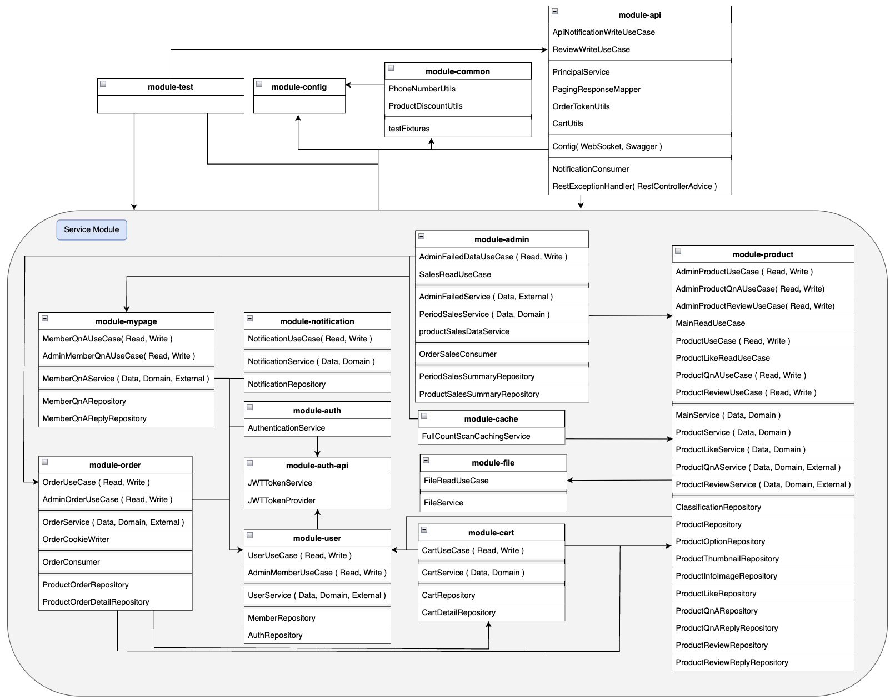
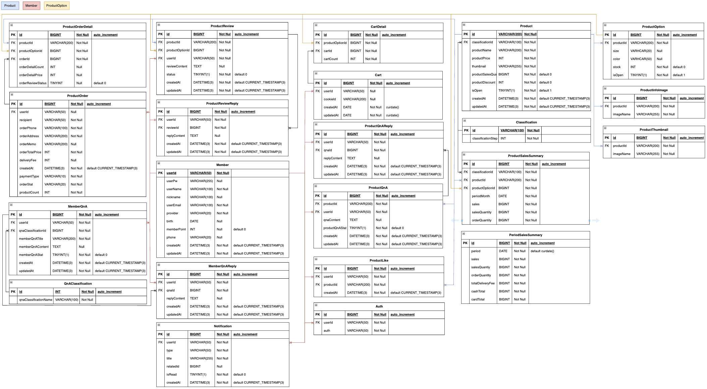
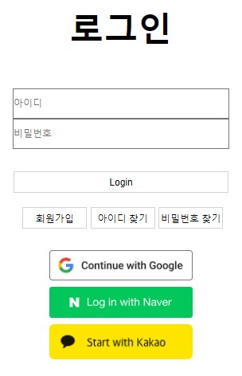

# Man's Shop Multi-module


# 프로젝트 요약
> 소규모 개인 의류 쇼핑몰이라는 기획으로 진행한 개인 프로젝트입니다.   
> JDK 8, Spring MVC, MyBatis, Oracle, JSP 기반으로 처음 프로젝트를 시작했으며, 이후 JDK 17, Spring Boot 3.
> 초기 버전인 JDK 8, Spring MVC, MyBatis, Oracle, JSP 기반의 프로젝트를 JDK 17, Spring Boot 3.2.5, MySQL, React( jsx ) 환경에서 재구현했습니다.   
> 이후 Spring Boot 3.4.0 의 동일한 환경에서 멀티 모듈 구조로 개선을 진행했습니다.   
> JSP 버전은 마무리 이후 유지하고 있는 상태지만, 단일 모듈 및 멀티 모듈 버전은 지속적인 리팩토링과 기능 추가를 수행해 추가적인 기능과 개선된 구조를 갖고 있습니다.   
> 쇼핑몰에서 볼 수 있는 기본적인 상품 정보, 장바구니, 결제, 마이페이지, 로그인 ( 로컬 및 OAuth2 ) 기능들을 구현했으며, 관리자의 기능들은 예상되는 기능들을 설계해 구현했습니다.

### 각 버전 gitHub
- 최초 버전인 JSP 버전
  - https://github.com/Youndae/mansShop
- 단일 모듈 모놀리식 React 버전
  - https://github.com/Youndae/mansshop_boot

# 목차

<strong>1. [프로젝트 목적](#프로젝트-목적)</strong>   
<strong>2. [개발 환경](#개발-환경)</strong>   
<strong>3. [프로젝트 구조](#프로젝트-구조)</strong>   
<strong>4. [프로젝트 설계 규칙](#프로젝트-설계-규칙)</strong>   
<strong>5. [ERD](#ERD)</strong>   
<strong>6. [페이지별 기능 상세](#페이지별-기능-상세)</strong>   
<strong>7. [기능 및 개선 내역](#기능-및-개선-내역)</strong>

<br/>

# 프로젝트 목적
- Multi-module 구조에서의 설계 경험
- Clean Architecture 경험
- 추후 MSA까지 진행하기 위한 초석

<br/>

# 개발 환경
|Category| Tech Stack                                                                                                                                                                                                                                                                                                      |
|---|-----------------------------------------------------------------------------------------------------------------------------------------------------------------------------------------------------------------------------------------------------------------------------------------------------------------|
|Backend| - Spring Boot 3.4.0 <br/> - JDK 17 <br/> - Gradle <br/> - Spring Data JPA <br/> - QueryDSL <br/> - RabbitMQ 3.12 Management <br/> - SpringSecurity <br/> - JWT <br/> - OAuth2(Google, Kakao, Naver) <br/> - Swagger( springdoc-openapi 2.6.0 ) <br/> - Java Mail <br/> - I'mport 결제 API ( iamport-rest-client ) |
|Database| - MySQL <br/> - Redis                                                                                                                                                                                                                                                                                           |
|Environment| - IntelliJ <br/> - GitHub <br/> - Docker ( Local ( MySQL, Redis, RabbitMQ ) )                                                                                                                                                                                                                                   |
|test| - mailhog <br/> - awaitility 4.2.0                                                                                                                                                                                                                                                                              |

<br/>

# 프로젝트 구조


<br/>

- JDK 17, Spring Boot 3.4.0 기반 Backend
- Gateway 역할의 api 모듈
- 공통 설정 파일이 위치하는 config 모듈
- Entity, 여러 모듈에서 사용되는 Util 또는 DTO가 위치하는 common 모듈
- 도메인별 서비스 모듈 분리
  - 크게 상품(product), 마이페이지(mypage), 관리자(admin), 인증 / 인가 및 보안(auth),    
    인증 / 인가 관련 서비스(auth-api), 주문(order), 캐싱(cache), 파일 관리(file),   
    사용자(user), 장바구니(cart), 알림(notification) 도메인으로 설계하고 분리.
- 통합 테스트를 원활하게 하기 위한 test 모듈
- 서버 실행을 위한 jar 파일은 api 모듈에 위치
- UseCase를 활용한 Clean Architecture

<br/>

# 프로젝트 설계 규칙
- Clean Architecture를 최대한 준수
- 의존성 설계는 도메인의 기능을 기준으로 설계
  - 불가피하게 양방향이 될 가능성이 존재하는 경우 참조해야 할 로직 또는 Repository를 분석해 더 많은 참조가 필요한 것을 우선시 해서 설계
  - 자신을 참조하고 있는 모듈의 Repository 또는 로직이 필요한 경우 Orchestration 책임을 api 모듈의 Controller로 넘겨서 처리
- UseCase
  - Orchestration 역할을 최대한 준수할 것.
  - 데이터 조작 ( 조회, 갱신, 삭제 등), 비즈니스 로직은 최대한 서비스 메서드를 통해 처리하도록 설계 
  - HTTP Method 기준 GET 요청은 ReadUseCase, 그 외 PATCH, PUT, DELETE, POST 등의 요청은 WriteUseCase로 명명
- Service
  - 대부분 1 : 1 매핑이 되기 때문에 Interface가 존재하지 않는 서비스 구조로 설계
  - 용도에 따라 Data, Domain, External Service로 분리
    - MySQL, Redis 등을 통한 데이터 조작은 DataService로 명명
    - 비즈니스 로직, 검증 관련 로직은 DomainService로 명명
    - 메일 전송, RabbitMQ 호출 등 외부 시스템 호출 관련은 ExternalService로 명명
  - 메서드 분리
    - 단일 책임 원칙을 최대한 준수할 수 있도록 단위별 설계
    - 기능에 완전 종속적이고 재사용 가능성이 없으며 로직이 단순한 경우에는 분리하지 않고 하나의 메서드로 설계
      - 이런 케이스까지 분리하게 되면 과한 세분화로 인한 복잡성 증가 우려
- config
  - 대부분의 모듈에서 사용되는 공통적인 설정 클래스를 담는 모듈로 설계
  - 특정 모듈에서 주로 사용되는 설정 클래스의 경우 해당 모듈에 작성하는 것으로 분리
    - 의존성을 잘 확인하며 설계
  - 모든 yml, 그리고 yml 값들의 사용을 위한 @ConfigurationProperties 적용 클래스들을 배치
- common
  - Entity, CustomException, 2개 이상의 모듈에서 사용되는 DTO 및 Util 클래스를 담는 모듈로 설계
    - 의존성에 따라 common에 위치할 필요가 없는 DTO 또는 Util이 있을 수 있으니 충분한 검토 필요
  - 테스트시 사용될 testFixtures를 두고 모든 테스트 fixture는 common에 배치
    - java-test-fixtures 플러그인 설정
    - 테스트 fixture가 필요한 모듈에서는 testImplementation(testFixtures())를 통해 common 의존성을 build.gradle에 포함
- auth
  - 인증 / 인가, 보안 관련 설정 및 필터를 담는 모듈로 설계
    - Spring Security 설정과 OAuth2User, User를 상속, 구현하는 Custom 클래스들이 포함
- auth-api
  - 인증 / 인가, 보안 관련된 서비스를 담는 모듈로 설계
- api
  - 모든 Controller가 위치하며 ExceptionHandler, WebSocket 등의 웹 계층을 담당하는 모듈로 설계
  - 최대한 모든 처리는 각 모듈의 UseCase 호출을 통해 처리하도록 설계
    - 여러 모듈을 통해야 하는 경우에는 Orchestration 책임을 넘겨 받아 여러 모듈의 UseCase 호출 또는 api 모듈의 UseCase를 통해 처리하도록 설계
  - 특성상 모든 모듈을 참조
- test
  - 각 모듈에서는 자신의 Service, UseCase에 대한 UnitTest만 처리
    - Unit Test는 로직이 너무 단순하거나, 전체 Mocking으로 인해 의미없는 케이스는 제외 
  - module-test에서는 모든 서비스 모듈의 Service, UseCase에 대한 Integration Test를 처리
    - 의존성 구조때문에 운영 환경에 필요하지 않은 다른 모듈의 테이블 데이터가 더미데이터로 필요한 경우가 많으므로 테스트 데이터 생성을 위함
  - module-api는 모든 컨트롤러의 Integration Test를 처리

<br/>

# ERD


<br/>

# 페이지별 기능 상세

<details>
  <summary><strong>공통</strong></summary>

* 실시간 알림 ( 회원 )
  * 관리자의 주문 확인
  * 상품 문의 답변
  * 회원 문의 답변
  * 리뷰 답변
</details>

<br/>

<details>
  <summary><strong>메인 화면</strong></summary>

* BEST, NEW, 상품 분류별 목록 출력
* 상품 리스트 페이징
* 상품명 검색
* 장바구니
  * 장바구니 상품 수량 증감
  * 장바구니 상품 선택 또는 전체 삭제
  * 장바구니 상품 선택 또는 전체 구매
* 주문 조회(비 로그인시에만 출력. 로그인 시 마이페이지에서 조회 가능)
* 로그인
  * 회원가입
  * 로컬 로그인 및 OAuth2 로그인 ( Google, Kakao, Naver )
  * 아이디 및 비밀번호 찾기 ( 비밀번호 찾기 기능은 Mail로 인증번호 전송을 통한 인증 이후 처리 )
  * 로그아웃
* 비회원
  * 장바구니( Cookie 기반 )
  * 주문 및 결제
  * 주문 내역 조회 ( 받는사람, 연락처 기반 )
</details>

<br/>

<details>
  <summary><strong>상품 상세</strong></summary>

* 상품 정보 출력
* 상품 옵션 선택
* 장바구니 담기
* 관심상품 등록
* 선택 상품 수량 증감
* 선택 상품 결제
* 상품 리뷰 리스트
* 상품 문의 목록 출력 및 작성
</details>

<br/>

<details>
  <summary><strong>마이페이지</strong></summary>

* 주문 목록
  * 배송완료 상품 리뷰 작성
* 관심 상품 목록
* 문의 내역
  * 상품 문의 내역
    * 문의 상세 정보
    * 문의 삭제
  * 회원 문의 내역
    * 문의 작성
    * 문의 상세 정보
      * 답변 작성
      * 문의 삭제
* 작성한 리뷰 목록
  * 작성한 리뷰 상세 및 삭제
  * 리뷰 수정
* 알림 목록
* 정보 수정
</details>

<br/>

<details>
  <summary><strong>관리자 페이지</strong></summary>

* 상품 관리
  * 상품 목록
  * 상품 검색
  * 상품 추가 및 수정
  * 상품 상세 정보
  * 재고 관리
  * 할인 설정
* 주문 관리
  * 미처리 주문 목록
    * 주문 정보
    * 주문 확인 처리
    * 미처리 주문 검색 ( 받는사람 or 사용자 아이디 )
  * 전체 주문 목록
    * 주문 정보
    * 전체 주문 검색 ( 받는사람 or 사용자 아이디 )
* 문의 관리
  * 상품 문의 관리
    * 미답변 상품 문의 목록
    * 전체 상품 문의 목록
    * 상품 문의 상세 정보
    * 상품 문의 답변 작성
    * 상품 문의 완료 처리
    * 상품 문의 검색 ( 닉네임 and 아이디 )
  * 회원 문의 관리
    * 미답변 회원 문의 목록
    * 전체 회원 문의 목록
    * 회원 문의 상세 정보
    * 회원 문의 답변 작성
    * 회원 문의 완료 처리
    * 회원 문의 검색 ( 닉네임 and 아이디 )
  * 회원 문의 카테고리 설정
    * 카테고리 추가, 삭제
* 회원 관리
  * 회원 목록
  * 회원 상세 정보
    * 회원 주문 목록 조회
    * 회원 상품 문의 내역 조회
    * 회원 문의 내역 조회
* 매출 관리
  * 기간별 매출
    * 선택 연도 월별 매출 목록 및 연매출, 판매량, 주문량
    * 월 매출 상세 정보
      * 베스트 5 상품, 분류별 매출, 일별 매출
      * 분류별 상세 매출
      * 선택 날짜의 전체 주문 내역 조회
  * 상품별 매출
    * 상품별 매출 목록
    * 검색 ( 상품명 )
    * 상품별 매출 상세 정보
      * 옵션별 매출 내역
* 데이터 관리 ( RabbitMQ DLQ 관리 )
  * 실패 메시지 관리
  * 실패 주문 관리
</details>

<br/>

# 기능 및 개선 내역

### 목차

<strong>[기능](#기능)</strong>
1. [인증 인가 처리](#인증-인가-처리)
2. [OAuth2 요청 및 토큰 발급 처리](#OAuth2-요청-및-토큰-발급-처리)
3. [실시간 알림 처리](#실시간-알림-처리)

<strong>[개선 및 문제 해결](#개선-및-문제-해결)</strong>
1. [참조할 수 없는 모듈의 Repository 사용](#참조할-수-없는-모듈의-Repository-사용)
2. [RabbitMQ 처리 검증 문제](#RabbitMQ-처리-검증-문제)
3. [JMeter 테스트 수행 및 결과](#JMeter-테스트-수행-및-결과)
4. [주문 및 매출 집계 처리 개선 RabbitMQ 적용](#주문-및-매출-집계-처리-개선-RabbitMQ-적용)
5. [주문 데이터 처리 실패 대응](#주문-데이터-처리-실패-대응)
6. [RabbitMQ 실패 메시지 재처리](#RabbitMQ-실패-메시지-재처리)
7. [쿼리 튜닝](#쿼리-튜닝)
8. [count 쿼리 캐싱](#count-쿼리-캐싱)
9. [상품 추가 및 수정에서 JPA 이슈와 파일관리](#상품-추가-및-수정에서-JPA-이슈와-파일관리)

<br/>

## 기능

---

### 인증 인가 처리

<br/>

인증 인가 처리는 JWT와 Spring Security를 같이 사용했습니다.   
SpringSecurity는 검증된 토큰을 기반으로 Authentication 객체를 SecurityContextHolder.setAuthentication()을 통해 담아 관리하게 됩니다.   
권한 관리는 컨트롤러 혹은 메소드 단위로 @PreAuthorize Annotation을 통해 관리합니다.

JWT는 AccessToken과 RefreshToken 구조로 설계했습니다.   
또한, 다중 디바이스 로그인을 허용하기 위해 ino라는 디바이스 식별 목적의 값이 같이 처리되는 구조입니다.   
AccessToken은 1시간, RefreshToken은 2주의 만료기간을 갖도록 처리했으며, ino는 JWT로 생성하는 것이 아니기 때문에 자체적인 만료 기간은 없습니다.

서버에서의 토큰 관리는 Redis로 관리하게 됩니다.   
이때 key 구조는 at 또는 rt 라는 각 토큰의 약어로 시작합니다. 토큰 약어 + ino + 사용자 아이디 구조로 키값을 생성하게 됩니다.   
클라이언트에서는 AccessToken과 만료시간을 LocalStorage에 보관하며 RefreshToken과 ino는 쿠키로 관리합니다.   
각 만료시간은 토큰 만료시간과 동일하게 갖게 되며, ino는 9999일의 긴 기간을 주어 사실상 만료되지 않도록 설계하고 로그아웃 또는 토큰이 탈취된 경우에만 제거됩니다.   
ino가 제거되지 않는 한 해당 디바이스의 Redis Key 구조는 동일하기 때문에 전체 토큰이 만료되더라도 재 로그인 과정에서 Redis 데이터 비교를 통해 토큰 탈취를 판단할 수 있습니다.

서버에서 응답할 때 AccessToken은 Authorization Header에 담아 반환하게 되며, RefreshToken과 ino는 응답 쿠키에 담아 반환합니다.   
이때, 쿠키 설정으로는 SameSite Strict, HttpOnly, Secure 설정을 하도록 설계했습니다.   
각 요청에 따라 구조의 차이가 조금은 존재하지만, 공통적으로 응답 body에 AccessToken의 만료시간을 같이 담아 반환하게 됩니다.   
응답을 받은 클라이언트에서는 LocalStorage에 { token: 토큰값, expires: 만료시간 } 구조로 저장하게 됩니다.

재발급 방식은 Refresh Token Rotation 방식으로 처리해 긴 만료시간을 갖는 Refresh Token의 단점을 상쇄할 수 있도록 했습니다.

```java
@Override
protected void doFilterInternal(HttpServletRequest request,
                                HttpServletResponse response,
                                FilterChain chain) throws ServletException, IOException {
    String accessToken = request.getHeader(accessHeader);
    Cookie refreshToken = WebUtils.getCookie(request, refreshHeader);
    Cookie inoToken = WebUtils.getCookie(request, inoHeader);
    String username = null; // Authentication 객체 생성 시 필요한 사용자 아이디

    if(inoToken != null){
        String inoValue = inoToken.getValue();
        if(accessToken != null && refreshToken != null) {
            String refreshTokenValue = refreshToken.getValue();
            String accessTokenValue = accessToken.replace(tokenPrefix, "");

            if(!jwtTokenProvider.checkTokenPrefix(accessToken)
                    || !jwtTokenProvider.checkTokenPrefix(refreshTokenValue)){
                chain.doFilter(request, response);
                return;
            }else {
                String claimByAccessToken = jwtTokenProvider.verifyAccessToken(accessTokenValue, inoValue);

                if(claimByAccessToken.equals(Result.WRONG_TOKEN.getResultKey())
                        || claimByAccessToken.equals(Result.TOKEN_STEALING.getResultKey())){
                    jwtTokenService.deleteCookieAndThrowException(response);
                    return;
                }else if(claimByAccessToken.equals(Result.TOKEN_EXPIRATION.getResultKey())){
                    if(request.getRequestURI().equals("/api/reissue")) {
                        chain.doFilter(request, response);
                    }else
                        jwtTokenService.tokenExpirationResponse(response);

                    return;
                }else {
                    username = claimByAccessToken;
                }
            }
        }else if(accessToken != null && refreshToken == null){
            String decodeTokenClaim = jwtTokenProvider.decodeToken(accessToken.replace(tokenPrefix, ""));

            jwtTokenService.deleteTokenAndCookieAndThrowException(decodeTokenClaim, inoValue, response);
            return;
        }else {
            chain.doFilter(request, response);
            return;
        }
    }

    if(username != null){
        Member memberEntity = userDataService.getMemberByUserIdFetchAuthsOrElseIllegal(username);
        String userId;
        Collection<? extends GrantedAuthority> authorities;
        CustomUserDetails userDetails;

        if(memberEntity.getProvider().equals("local"))
            userDetails = new CustomUser(memberEntity);
        else
            userDetails = new CustomOAuth2User(
                    memberEntity.toOAuth2DTOUseFilter()
            );

        userId = userDetails.getUserId();
        authorities = userDetails.getAuthorities();

        Authentication authentication =
                new UsernamePasswordAuthenticationToken(userId, null, authorities);

        SecurityContextHolder.getContext().setAuthentication(authentication);
    }

    chain.doFilter(request, response);
}
```

SecurityFilterChain 설정에서 beforeFilter에 JWTAuthorizationFilter를 설정해 두었기 떄문에 모든 요청은 위 필터를 거치게 됩니다.   
처리 과정에서 가장 먼저 ino 존재 여부를 확인하게 되는데 ino가 없는 경우 토큰 검증은 가능하지만 Redis 데이터와 비교가 불가능하기 때문에 검증을 수행하지 않고 인증 처리를 하지 않도록 설계했습니다.

ino가 존재한다면 토큰 검증 및 Redis 데이터와 비교를 처리하게 됩니다.   
조건에 따라 검증이 안되는 잘못된 토큰 혹은 Redis 데이터와 불일치 하는 탈취라고 판단되는 토큰, 정상 토큰으로 나눠집니다.   
잘못된 토큰이라는 응답의 경우 토큰은 있으나 Redis 데이터가 없거나, 토큰 검증이 실패한 토큰입니다.   
이 경우 Redis 데이터 처리가 불가능하기 때문에 응답 쿠키로 만료된 쿠키들을 담아준 뒤 800이라는 상태값과 함께 바로 응답을 반환하게 됩니다.   
탈취로 판단된 토큰의 경우 동일하게 응답 쿠키에 만료된 쿠키들을 담아주고 Redis 데이터까지 삭제한 뒤 800이라는 상태값과 함께 바로 응답을 반환하게 됩니다.   
800 응답을 받은 클라이언트에서는 LocalStorage에 저장된 AccessToken을 제거하고 인증 과정에서 문제가 있었음을 사용자에게 알려 재로그인을 유도합니다.   
쿠키의 경우 응답 쿠키가 바로 적용되기도 하고 HttpOnly 설정으로 인해 제어할 수 없으므로 따로 처리하지 않습니다.

토큰이 정상으로 판단되는 경우 RDB 데이터를 조회한 뒤 Authentication 객체 생성 및 SecurityContextHolder에 담아 관리하도록 처리합니다.

<br/>

### OAuth2 요청 및 토큰 발급 처리
<br />



로그인 처리로는 페이지에서 회원 가입후 로그인하는 로컬 로그인과 OAuth2 로그인이 있습니다.   
OAuth2 로그인은 Google, Naver, Kakao 세가지로 처리했으며 요청은 Frontend에서 window.location.href를 통해 요청하도록 했습니다.

```javascript
const handleOAuth = (e) => {
    const OAuthClient = e.target.name;
    
    window.sessionStorage.setItem('prev', state.toString());
    
    if(oAuthClient === 'google')
        window.location.href = 'http://localhost:8080/oauth2/authorization/google';
    else if(oAuthClient === 'naver')
        window.location.href = 'http://localhost:8080/oauth2/authorization/naver';
    else if(oAuthClient === 'kakao')
        window.location.href = 'http://localhost:8080/oauth2/authorization/kakao';
}
```

href 요청 이전 state에 이전 페이지 데이터를 담도록 처리했습니다.   
일반적인 로그인 요청에서는 200 응답을 받아 바로 이동하는 것이 가능하지만 href 요청의 경우 어렵기 때문입니다.   
그래서 SessionStorage에 담아두었다가 처리 완료 후 꺼내 처리할 수 있도록 설계했습니다.

서버에서는 OAuth2 인증 정보들을 application-oauth.yml에 저장해두었습니다.   
처리 과정중에 사용될 SimpleUrlAuthenticationSuccessHandler와 OAuth2User, DefaultOAuth2UserService는 customizing 처리해서 사용했습니다.   
SpringFilterChain Bean에서 oauth2Login 설정을 통해 OAuth2UserService와 SuccessHandler를 처리할 수 있도록 설정해두었습니다.

```java
//CustomOAuth2UserService
@Service
@RequiredArgsConstructor
public class CustomOAuth2UserService extends DefaultOAuth2UserService {

  private final UserDataService userDataService;

  @Override
  public OAuth2User loadUser(OAuth2UserRequest userRequest) throws OAuth2AuthenticationException {
    OAuth2User oAuth2User = super.loadUser(userRequest);
    String registrationId = userRequest.getClientRegistration().getRegistrationId();
    OAuth2Response oAuth2Response = null;

    if(registrationId.equals(OAuthProvider.GOOGLE.getKey()))
      oAuth2Response = new GoogleResponse(oAuth2User.getAttributes());
    else if(registrationId.equals(OAuthProvider.NAVER.getKey()))
      oAuth2Response = new NaverResponse(oAuth2User.getAttributes());
    else if(registrationId.equals(OAuthProvider.KAKAO.getKey()))
      oAuth2Response = new KakaoResponse(oAuth2User.getAttributes());

    String userId = oAuth2Response.getProvider() + "_" + oAuth2Response.getProviderId();
    Member existsData = userDataService.getMemberByUserIdOrElseNull(userId);

    if(existsData == null) {
      Member member = OAuth2ResponseEntityConverter.toEntity(oAuth2Response, userId);
      member.addMemberAuth(new Auth().toMemberAuth());
      userDataService.saveMember(member);
      existsData = member;
    }else if(!existsData.getUserEmail().equals(oAuth2Response.getEmail()) || !existsData.getUserName().equals(oAuth2Response.getName())){
      existsData.setUserEmail(oAuth2Response.getEmail());
      existsData.setUserName(oAuth2Response.getName());
      userDataService.saveMember(existsData);
    }

    OAuth2DTO oAuth2DTO = new OAuth2DTO(existsData);

    return new CustomOAuth2User(oAuth2DTO);
  }
}
```

각 Authorization Server 대한 처리를 공통적으로 처리할 수 있도록 OAuth2Response라는 인터페이스를 통해 처리하도록 설계했습니다.   
이 설계를 통해 추후 새로운 Authorization Server가 추가되더라도 유연하게 대응할 수 있습니다.   
응답 데이터를 처리한 뒤 provider 컬럼에 각 Authorization Server provider를 담게 되며 새로운 사용자인 경우 데이터를 새로 저장, 기존 사용자인 경우 Authorization Server로 부터 받은 데이터 기반으로 갱신을 처리하게 됩니다.   
이후 OAuth2DTO에 담아 CustomOAuth2User를 생성하고 반환해 처리가 완료된 이후 SuccessHandler에 접근합니다.

```java
// CustomOAuth2SuccessHandler
@Component
@RequiredArgsConstructor
@Slf4j
public class CustomOAuth2SuccessHandler extends SimpleUrlAuthenticationSuccessHandler {

  private final JWTTokenProvider jwtTokenProvider;

  @Override
  public void onAuthenticationSuccess(HttpServletRequest request,
                                      HttpServletResponse response,
                                      Authentication authentication) throws IOException, ServletException {
    CustomOAuth2User customOAuth2User = (CustomOAuth2User) authentication.getPrincipal();
    String userId = customOAuth2User.getUserId();
    jwtTokenProvider.createTemporaryToken(userId, response);

    response.sendRedirect("/oAuth");
  }
}
```
```javascript
//Oauth.jsx
function OAuth() {
  const navigate = useNavigate();

  useEffect(() => {
    const issuedToken = async () => {
      try{
        const res = await tokenRequest();
        const authorization = res.data.authorization;
        window.localStorage.setItem('authorization', authorization);

        const prevUrl = window.sessionStorage.getItem('prev');
        navigate(prevUrl);
      }catch(err){
        console.log(err);
      }
    }

    issuedToken();
  }, []);

  return null;
}

export default OAuth;
```

SuccessHandler에서는 사용자 아이디를 기반으로 임시 토큰을 생성한 뒤 응답 쿠키에 토큰을 담아 /oAuth 경로로 Redirect 합니다.      
그럼 Oauth 컴포넌트로 접근하게 되는데 이 컴포넌트는 아무런 UI를 처리하지 않는 컴포넌트입니다.   
단지 랜더링 시점에 useEffect를 통해 임시 토큰을 담아 정식 토큰 발급 요청을 보내게 되고, 정상적으로 토큰이 발급 되었다면 SessionStorage에 담아두었던 prev를 꺼내 로그인 이전 페이지로 이동하게 됩니다.   
이때, 발급 받은 토큰의 처리는 Axios Interceptor에 의해 처리되는데, Frontend 기능 내역에 따로 정리해두었습니다.

Redirect를 처리할 때 Authorization 헤더에 토큰을 담는 것은 보안상 적절하지 않다고 생각해 이렇게 처리했습니다.   
서버의 특정 요청 경로를 만들고 처리하는 방법도 테스트해봤지만 원하는 방법으로 해결할 수 없어 UI가 없는 컴포넌트를 통해 처리하게 되어 아쉬움이 남는 기능입니다.

<br/>

### 실시간 알림 처리

<br/>

로그인 상태에서는 실시간으로 알림을 받을 수 있도록 구현했습니다.   
알림 종류로는 상품 문의, 회원 문의, 리뷰의 답변과 주문 상태값이 상품 준비중으로 변경되는 경우로 총 4가지의 알림이 발생합니다.   
프론트엔드에서는 Toast로 알림이 출력되며 상품 문의, 회원 문의는 바로 해당 문의 상세 페이지로 이동할 수 있도록 구현했습니다.

알림 기능 구현에는 WebSocket + STOMP 구조로 구현했습니다.   
STOMP를 사용함으로써 pub/sub 구조를 보다 간결하게 처리할 수 있었으며, 프론트엔드에서 Redux를 통해 사용자 아이디를 관리하고 있기에 사용자 아이디를 기반으로 세션을 생성하고 추적할 수 있도록 구현했습니다.

관리자의 기능 요청에 의해 알림 발생이 필요한 경우 RabbitMQ를 통해 비동기 처리로 알림 서비스를 호출하는 구조로 설계했습니다.

```java
//알림이 발생하는 관리자 기능 중 하나인 상품 문의 답변 작성
@Service
@RequiredArgsConstructor
@Slf4j
public class AdminProductQnAWriteUseCase {

    private final ProductQnADataService productQnADataService;
    private final ProductQnADomainService productQnADomainService;
    private final ProductQnAExternalService productQnAExternalService;
    private final UserDataService userDataService;
    
    @Override
    public String postProductQnAReply(QnAReplyInsertDTO insertDTO, Principal principal) {
        Member member = userDataService.getMemberByUserIdOrElseIllegal(userId);
        ProductQnA productQnA = productQnADataService.findProductQnAByIdOrElseIllegal(insertDTO.qnaId());
        ProductQnAReply productQnAReply = productQnADomainService.buildProductQnAReply(member, productQnA, insertDTO.content());
  
        productQnADataService.saveProductQnAReply(productQnAReply);
        patchProductQnAStatusAndSave(productQnA);

        productQnAExternalService.sendProductQnANotification(productQnA);
        
        return Result.OK.getResultKey();
    } 
}


//ProductQnAExternalService
@Service
@RequiredArgsConstructor
public class ProductQnAExternalService {

  private final RabbitMQProperties rabbitMQProperties;

  private final RabbitTemplate rabbitTemplate;

  public void sendProductQnANotification(ProductQnA productQnA) {
    String notificationTitle = productQnA.getProduct().getProductName() + NotificationType.PRODUCT_QNA_REPLY.getTitle();

    rabbitTemplate.convertAndSend(
            rabbitMQProperties.getExchange().get(RabbitMQPrefix.EXCHANGE_NOTIFICATION.getKey()).getName(),
            rabbitMQProperties.getQueue().get(RabbitMQPrefix.QUEUE_NOTIFICATION.getKey()).getRouting(),
            new NotificationSendDTO(
                    productQnA.getMember().getUserId(),
                    NotificationType.PRODUCT_QNA_REPLY,
                    notificationTitle,
                    productQnA.getId()
            )
    );
  }
}
```

알림 제목의 기본적인 틀은 NotificationType이라는 enum으로 관리합니다.   
회원 및 상품 문의의 경우 문의 제목 또는 상품명이 포함된 제목으로 설계했기 때문에 별도의 알림 제목 값을 만들어 추가하게 됩니다.

```java
@Component
@Slf4j
public class NotificationConsumer {

  private final ApiNotificationWriteUseCase apiNotificationWriteUseCase;

  public NotificationConsumer(ApiNotificationWriteUseCase apiNotificationWriteUseCase) {
    this.apiNotificationWriteUseCase = apiNotificationWriteUseCase;
  }

  @RabbitListener(queues = "${rabbitmq.queue.notificationSend.name}", concurrency = "3")
  public void consumeNotification(NotificationSendDTO notificationDTO) {
    apiNotificationWriteUseCase.sendNotification(notificationDTO);
  }
}

```

RabbitMQ의 역할은 단순히 비동기적으로 알림 서비스를 호출하는 역할만 담당합니다.   
RabbitMQ에서도 STOMP Plugin 설치 후 Queue로 관리하는 방법도 있지만, 현재 애플리케이션에서는 알림 메시지의 유실에 대해 좀 더 관대하게 처리해도 되며 이 알림 큐 역시 DLQ가 존재하기 때문에 STOMP plugin까지 사용하는건 과한 오버스펙이라고 생각했습니다.

```java
@Service
@RequiredArgsConstructor
@Slf4j
public class ApiNotificationWriteUseCase {

  private final NotificationWriteUseCase notificationWriteUseCase;

  private final SimpMessagingTemplate messagingTemplate;

  public void sendNotification(NotificationSendDTO sendDTO) {
    notificationWriteUseCase.saveNotificationData(sendDTO);

    if(notificationWriteUseCase.isUseOnline(sendDTO.userId())){
      NotificationDTO responseMessage = new NotificationDTO(sendDTO.title(), sendDTO.relatedId());
      messagingTemplate.convertAndSendToUser(sendDTO.userId(), "/queue/notifications", responseMessage);
    }
  }
}
```

알림 서비스에서는 Notification 테이블에 알림 데이터를 저장한 뒤 convertAndSendToUser를 통해 알림을 발송하게 됩니다.   
WebSocket 연결 상태가 정상인 경우에만 알림을 전달할 수 있도록 처리했고, 이 처리를 위해 사용자의 연결 상태를 Redis에서 관리하게 됩니다.
프론트엔드에서 Health Check로 30초마다 요청을 보내게 되고, 그때마다 Redis 데이터의 만료시간을 갱신하도록 처리했습니다.
알림을 보내기 전 Redis 데이터를 체크함으로써 사용자가 현재 알림을 받을 수 있는 상태인지 확인하고 알림을 보내도록 해 불필요하게 온라인 상태가 아닌 사용자에게는 알림이 발생하지 않도록 했습니다.

ApiNotificationWriteUseCase는 module-api에 위치해 웹 계층에서 처리할 수 있도록 했습니다.   
알림 데이터 저장을 위해 NotificationRepository가 필요하다고 생각해 최초에는 module-notification에 위치했었지만 구현체 의존성 문제로 인해 알림 전송 로직을 module-api에서 처리하도록 수정해야 했습니다.   
module-api의 경우 모든 모듈을 참조하고 있기 때문에 Notification 저장에 아무런 문제가 발생하지 않을것이라고 생각했고, NotificationSendDTO를 Entity로 변환, 저장하는 로직은 NotificationWriteUseCase에 작성하고 처리하도록 설계해 책임 분리를 명확히 하고자 했습니다.

사용자 아이디를 기반으로 세션을 구분하기 때문에 프론트엔드에서 연결을 시도할 때 JWT가 필요했습니다.   
AccessToken의 경우 requestHeader에 담겨져 보내지기 때문에 괜찮았지만, RefreshToken, ino는 Cookie에 저장되기 때문에 전달이 되지 않는다는 문제가 있었습니다.

```java
@Configuration
@EnableWebSocketMessageBroker
@Slf4j
public class WebSocketConfig implements WebSocketMessageBrokerConfigurer {

    private final JWTTokenProvider tokenProvider;
  
    @Value("#{jwt['token.all.prefix']}")
    private String tokenPrefix;
  
    @Value("#{jwt['token.access.header']}")
    private String accessHeader;
  
    @Value("#{jwt['cookie.ino.header']}")
    private String inoHeader;
  
    public WebSocketConfig(JWTTokenProvider jwtTokenProvider) {
      this.tokenProvider = jwtTokenProvider;
    }

    @Override
    public void registerStompEndpoints(StompEndpointRegistry registry) {
      registry.addEndpoint("/ws")
              .addInterceptors(
                  new HandshakeInterceptor() {
                    @Override
                    public boolean beforeHandshake(ServerHttpRequest request,
                                                   ServerHttpResponse response,
                                                   WebSocketHandler wsHandler,
                                                   Map<String, Object> attributes) throws Exception {
                      if(request instanceof ServletServerHttpRequest) {
                        HttpServletRequest servletRequest = ((ServletServerHttpRequest) request).getServletRequest();
                        Cookie[] cookies = servletRequest.getCookies();

                        if(cookies != null) {
                          for(Cookie cookie : cookies) {
                            if(cookie.getName().equals(inoHeader))
                              attributes.put("ino", cookie.getValue());
                          }
                        }else
                          log.warn("WebSocket Connection cookie is null");
                      }

                      return true;
                    }

                    @Override
                    public void afterHandshake(ServerHttpRequest request, 
                                               ServerHttpResponse response, 
                                               WebSocketHandler wsHandler, 
                                               Exception exception) {}
                  }
              )
              .withSockJS()
              .setSessionCookieNeeded(true)
              .setHeartbeatTime(25000)
              .setDisconnectDelay(30000);
    }

    @Override
    public void configureMessageBroker(MessageBrokerRegistry registry) {
      registry.enableSimpleBroker("/topic", "/queue");
  
      registry.setApplicationDestinationPrefixes("/app");
    }
  
    @Override
    public void configureClientInboundChannel(ChannelRegistration registration) {
      registration
            .interceptors(
                new ChannelInterceptor() {
                  @Override
                  public Message<?> preSend(Message<?> message, MessageChannel channel) {
                    StompHeaderAccessor accessor = MessageHeaderAccessor.getAccessor(message, StompHeaderAccessor.class);
      
                    if(accessor != null && accessor.getCommand() == StompCommand.CONNECT) {
                      String token = accessor.getFirstNativeHeader(accessHeader);
                      String inoValue = (String) accessor.getSessionAttributes().get("ino");
      
                      if (token != null) {
                        String tokenValue = token.replace(tokenPrefix, "");
                        String userId = tokenProvider.verifyAccessToken(tokenValue, inoValue);
      
                        if(userId != null && !userId.equals("WRONG_TOKEN") && !userId.equals("TOKEN_EXPIRATION") && !userId.equals("TOKEN_STEALING")) {
                          accessor.setUser(() -> userId);
                          log.info("WebSocket Principal set : {}", userId);
                        }
                      }
                    }
      
                    return message;
                  }
                }
          );
    }
}
```

이 문제는 WebSocket 설정 파일에서 Interceptor를 통해 해결할 수 있었습니다.   
Endpoint 설정에서 Interceptor를 통해 request에 담긴 쿠키를 꺼내 attributes에 담도록 함으로써 ClientInboundChannel의 Interceptor에서 모든 토큰을 확인, 검증 할 수 있도록 처리했습니다.

<br/>

## 개선 및 문제 해결

---

### 참조할 수 없는 모듈의 Repository 사용

<br/>

도메인별로 모듈을 분리하고 설계하면서 참조할 수 없는 모듈의 Repository를 사용해야 하는 경우가 발생했습니다.   
가장 대표적인 문제점으로는 auth 모듈의 JWTAuthorizationFilter에서 토큰 검증 이후 MemberRepository를 통해 사용자 정보를 조회할 수 있어야 한다는 것입니다.   
다른 서비스 모듈의 경우 api 모듈의 Controller에서 Orchestration을 담당해 다른 모듈의 UseCase를 호출하는 것으로 대처할 수 있었지만, Filter에서 필요로 하는 경우는 제어할 수 없었기 때문에 다른 문제였습니다.   

최초 설계시에는 auth 모듈에 Member, AuthRepository를 두고 필요로 하는 모듈들이 auth 모듈을 참조하는 구조였습니다.   
그러나, auth 모듈의 경우 인증 / 인가, 보안에 대한 책임을 담당하는 모듈로 다른 모듈이 참조하는 것은 좋지 않은 구조였고, 결국 Repository를 user 모듈로 옮기게 되었습니다.
하지만, 이런 경우 auth가 user 모듈을 참조해야 하기 때문에 user 모듈은 auth 모듈의 JWTTokenProvider, JWTTokenService등 JWT 관련 서비스들을 사용할 수 없게 된다는 또 다른 문제가 있었습니다.   

이 문제를 해결하기 위해 처음에는 user -> auth로 의존성을 설계하고 auth 모듈에서는 AuthMemberReader, AuthMemberStore라는 인터페이스를 갖도록 하고 그 구현체를 user 모듈에 둠으로써 문제를 해결하고자 했습니다.   
실제로 컨트롤러 통합 테스트에서 문제가 발생하지 않았고 이대로 문제를 해결했다고 생각했었습니다.   
또한 다른 서비스 모듈까지 모두 이런 Interface - impl 방식을 통해 참조할 수 없는 다른 모듈의 Repository를 사용하도록 처리했습니다.   

그러나, 프로젝트 마무리 이후 build를 통해 전체 테스트를 수행할 때 문제가 발생했습니다.   
기존에 각 테스트 클래스를 독립적으로 실행했을 때는 test, api 모듈이 모든 모듈에 대한 의존성을 갖고 있었기 때문에 문제가 발생하지 않았지만, 멀티 모듈 구조 특성 상 각 모듈별로 빌드가 실행되기 때문에 그 과정에서 context의 차이가 발생하여 해당 모듈의 의존성에 의해 구현체를 찾지 못한다는 문제였습니다.   
조금만 깊게 생각해봤다면 참조하지 않는 모듈에 위치한 구현체를 통해 처리할 수 없다는 것을 알았을텐데 모듈간 의존성에 대해 너무 가볍게 생각한 결과였습니다.   

이 문제를 해결하기 위해 서비스 모듈들은 이전에 언급한 것 처럼 컨트롤러에서 다른 모듈로 접근해 조합하는 형태로 해결할 수 있었습니다.   
그리고 Filter에서의 처리 때문에 이런 방법이 통하지 않는 auth 모듈은 조금 다르게 처리해 문제를 해결할 수 있었습니다.   
의존성의 방향성을 고려해 auth -> user 방향으로 의존성을 처리하고 user에서 auth를 참조해야 했던 이유인 JWTTokenProvider, JWTTokenService를 auth-api라는 별도의 모듈을 생성해 옮겼습니다.   
이 두 서비스 클래스가 auth에 있었던 이유는 Filter에서도 사용해야 했기 때문이었는데 auth-api 모듈로 분리하게 되면서 auth는 user, auth-api를 참조하면 정상적인 빌드와 동작이 가능하게 되며, user 모듈 역시 자신이 필요한 서비스가 auth-api에 있기 때문에 auth가 아닌 auth-api를 참조하는 것으로 문제가 해결되었습니다.   
의존성 역시 순환 참조로 이어질 가능성 없이 문제를 해결할 수 있었습니다.   

이 문제를 해결해 나가면서 단일 모듈 구조보다 도메인 설계에 더 많은 신경을 써야 하고, 전체 모듈을 참조하는 api 나 test 같은 모듈을 너무 맹신하기 보다 의존성 구조에 대해 좀 더 고민하는 과정이 중요하다는 것을 느낄 수 있었습니다.   

<br/>

### RabbitMQ 처리 검증 문제

<br/>

이전 버전인 단일 모듈 버전에서 RabbitMQ를 도입하게 되어 테스트 과정에 RabbitMQ를 통한 데이터 처리가 정상적으로 되었는지 테스트 과정에서 검증할 수 있어야 한다고 생각했습니다.   
실제로 이전 버전에서도 RabbitMQ 호출을 포함하고 있는 통합 테스트의 경우 awaitility를 통해 RabbitMQ를 통한 데이터 처리를 검증했습니다.   

이번 버전에서도 동일한 기능을 하고 있기 때문에 테스트 클래스에서 검증하고자 했으나 consumer에서 테스트 데이터에 접근하지 못하는 문제가 발생했습니다.   
테스트 클래스를 직접 실행하는 경우에는 정상적으로 동작했지만, build 를 통해 테스트하는 과정에서는 실패하는 것을 확인할 수 있었습니다.
이전 버전에서의 경험으로 @Transactional이 테스트 클래스에 정의되어있다면 테스트 트랜잭션과 consumer의 트랜잭션이 같은 경계에 있지 않아 접근할 수 없다는 점을 알 수 있었습니다.   
그래서 이번 역시 @Transactional을 사용하지 않고 수행했음에도 Consumer는 접근할 수 없었고, null 또는 Exception을 발생시키는 문제가 발생했습니다.   

알아본 결과 이 문제는 Application Context가 어떻게 처리되는지에 따른 문제인 것을 알 수 있었습니다.   
이전 버전과 같은 단일 모듈 구조에서는 하나의 SpringBootApplication에 의해 동작하게 됩니다.   
하지만 멀티 모듈의 경우 각 모듈에 SpringBootApplication이 존재하기 때문에 테스트 모듈에 따라 모든 Application Context를 가져오지 않아 발생하는 문제라고 확인할 수 있었습니다.   

이 문제를 해결하기 위해서는 2가지 방법이 있다고 생각했습니다.   
첫 번째는 .sql 파일 또는 다른 테스트 클래스들과 다른 또 하나의 테스트 데이터베이스에 데이터를 미리 담아두고 테스트 하는 방법입니다.   
그럼 이미 저장되어 commit된 데이터이기 때문에 Consumer 역시 접근할 수 있게 되고 정상 동작까지 확인할 수 있습니다.   
하지만 이렇게 처리하는 경우 .sql 파일을 통해 저장된 데이터를 테스트 종료 시 제거해야 하는 처리가 추가되어야 하기 때문에 테스트가 더욱 무거워지거나, 테스트 데이터베이스가 2개 존재해야 한다는 점이 문제였습니다.   

두 번째는 MockMvc를 사용하는 컨트롤러 통합 테스트에서만 검증하고 UseCase 통합 테스트에서는 Mocking으로 처리하는 방법입니다.   
특이하게도 컨트롤러 통합 테스트에서는 consumer가 테스트 데이터에 정상적으로 접근하는 것을 확인할 수 있었습니다.   
이 이유에 대해서도 알아보니 MockMvc.perform()의 경우 flush()가 수행되기도 하지만 controller -> service -> repository의 흐름이 모두 같은 트랜잭션 경계 내에서 실행된다는 이유였습니다.   
그래서 컨트롤러 통합 테스트에서 RabbitMQ 실행의 처리를 검증하고 UseCase의 통합 테스트에서는 Mocking 한다면 전체 테스트를 필수로 수행한다는 전제하에 검증을 할 수 있습니다.   

이 두 방법 중 두 번째 방법으로 문제를 해결했습니다.   
UseCase와 컨트롤러 모두의 통합 테스트에서 RabbitMQ를 검증할 수 있다면 더 좋겠지만, 이미 검증할 수 있는 다른 수단이 있는데도 .sql 파일 또는 별개의 데이터베이스를 통해 무거워지는 것은 비효율적이라고 생각했습니다.   
하지만, 만약 RabbitMQ로 처리하는 로직이 지금보다 더 중요한 로직이고 테스트의 중요도가 높아진다면 당연히 별도의 테스트 혹은 UseCase에서까지 필수로 검증할 수 있도록 처리해야 한다고 생각합니다.

컨트롤러 및 UseCase 테스트 코드는 아래 링크를 통해 확인하실 수 있습니다.

<a href="https://github.com/Youndae/mansShop_multi/blob/master/module-api/src/test/java/com/example/moduleapi/controller/order/OrderControllerIT.java#L362">OrderController Inetgration test</a>   
<a href="https://github.com/Youndae/mansShop_multi/blob/master/module-test/src/test/java/com/example/moduletest/order/useCase/OrderWriteUseCaseIT.java#L292">OrderWriteUseCase Integration test</a>
<br/>

### JMeter 테스트 수행 및 결과
<br />

리팩토링 이후 JMeter를 통한 테스트를 진행했습니다.   
테스트 목적은 기능에 대한 성능 최적화입니다.   
사용하지 않는 구형 노트북에 Ubuntu 24.04.01을 설치한 뒤 Docker로 MySQL, Redis, RabbitMQ를 사용해 배포했습니다.   
JMeter는 데스크탑에서 실행했고 공유기로 인한 같은 로컬 환경에서의 테스트로 진행했습니다.

테스트 데이터로는 사용자 및 상품 데이터 2000개 가량, 그 외 테이블들은 250만개 이상의 더미데이터를 담아두고 테스트했습니다.   
테스트 설정은 500 Thread, 5 Ramp-up, Loop count 1 환경에서 수행했으며, 관리자의 경우 상대적으로 요청이 적게 발생하는 만큼 20 Thread, 1 Ramp-up 환경으로 수행했습니다.   
이 설정은 가장 원활하게 처리되던 메인 페이지 조회 기능 기준으로 여러 수치에 대한 테스트를 진행하며 결정하게 되었습니다.   
평균적으로 200ms를 넘어가지 않는 기능이었지만, 500 Thread가 넘는 수치에서는 1500ms 이상의 비정상적으로 치솟는 결과를 볼 수 있었기에 최적화에 가장 적합한 최대치라고 생각했습니다.

하단의 이미지는 테스트 결과를 정리한 엑셀 파일의 일부입니다.   
가장 문제가 많아 최적화를 많이 수행한 부분이 관리자 파트였기 때문에 관리자 기능 위주로 자료를 준비했습니다.

테스트의 통과 기준은 평균 500ms대 까지로 잡았고, 목표에 맞춰 최적화를 수행했습니다.   
최적화는 데이터베이스 인덱싱, 쿼리 튜닝, 코드 레벨에서의 데이터 파싱 및 JPA 최적화를 수행했으며, 모든 요청에 대해 목표를 달성할 수 있었습니다.

이 테스트를 수행하기 이전 브라우저나 Postman을 통한 단일 요청 테스트에서는 모두 정상적인 수치를 보여주던 기능들이었지만, 운영 환경과 같은 다중 요청이 발생하는 경우 또 다른 결과를 볼 수 있다는 점을 알 수 있게 된 좋은 기회였습니다.
또한, 쿼리 튜닝과 인덱싱, JPA에 대해 좀 더 깊게 고민할 수 있었습니다.


<br />
<br />
<br />

### 주문 및 매출 집계 처리 개선 RabbitMQ 적용
<br />

Spring Boot 버전으로 새로 진행하면서 기존에 있던 집계 테이블은 제거했습니다.   
매출 기능에 대해 다양한 데이터를 보여주도록 개선하게 되면서 집계 테이블의 효율성이 떨어졌기 때문에 주문 및 상세 테이블에서의 집계 쿼리로 처리했습니다.   
단일 요청에서 준수한 성능을 보여줬기에 이 설계를 유지하고 있었는데 JMeter로 다중 요청 테스트를 진행해보니 측정 불가 수준의 성능 문제가 발생했습니다.
이 문제를 해결하기 위해 인덱싱과 쿼리 튜닝을 진행해봤지만 해결할 수 없었기에 집계 테이블을 다시 설계하게 되었고, 일별 집계 테이블과 상품 옵션별 월 매출 집계 테이블로 나눠 추가했습니다.

매출 기능은 이 개선을 통해 해결할 수 있었지만, 이 처리로 인해 주문 처리의 복잡도가 증가했습니다.   
주문 데이터 처리, 장바구니 데이터 처리, 상품 총 판매량 수정 처리, 옵션별 재고 수정, 2개의 집계 테이블에 대한 처리까지 모두 포함되어야 했습니다.   
하지만 사용자 입장에서 보면 주문 데이터 처리와 장바구니 데이터 처리만 관심사일 뿐, 다른 처리들은 사용자의 관심밖의 일이라고 생각해 이걸 기다리도록 처리하는건 비효율적이라고 생각했습니다.

이 문제를 해결하기 위한 방법으로 Batch 처리와 비동기 처리 방식를 생각할 수 있었습니다.   
하지만, 매출과 재고, 판매량의 실시간성이 보장되어야 한다는 점에서 Batch 처리는 적합하지 않았고, 비동기 처리 중 방법을 찾게 되었습니다.   
비동기 처리 방식으로는 @Async Annotation을 통한 처리와 MessageBroker를 사용하는 방법으로 나눌 수 있었습니다.   
@Async의 경우 비교적 간결한 설정으로 사용할 수 있다는 장점이 있었으나, 처리 과정 중 발생한 오류에 대응하기 어렵다는 단점이 있었습니다.   
반면, MessageBroker는 설정은 조금 복잡하더라도 실패 메시지 관리와 재시도 처리가 용이하다는 이점이 있어 MessageBroker를 선택했습니다.   
MessageBroker 중 RabbitMQ를 선택하게 되었는데 다른 선택지였던 Kafka는 목적에 비해 복잡하기도 하고 오버 스펙에 즉시처리가 RabbitMQ에 비해 떨어진다고 생각했습니다.   
그래서 즉시 처리가 더 수월하며 Dead Letter Queue 기능을 통한 실패 메시지 관리의 편의성을 갖고 있는 RabbitMQ를 적용해 문제를 해결했습니다.

RabbitMQ의 Exchange, Queue, DLQ의 name 또는 Routing Key는 모두 rabbitMQ.yml에서 관리하도록 처리했으며, RabbitMQProperties 클래스를 통해 사용할 수 있도록 처리했습니다.   
또한, 필요한 값의 유연한 조회를 처리하기 위해 RabbitMQPrefix라는 Enum을 생성해 같이 관리합니다.

```java
//RabbitMQPrefix
@Getter
@RequiredArgsConstructor
public enum RabbitMQPrefix {
    EXCHANGE_ORDER("order"),
    QUEUE_ORDER_PRODUCT("orderProduct"),
    QUEUE_ORDER_PRODUCT_OPTION("orderProductOption"),
    QUEUE_PERIOD_SUMMARY("periodSalesSummary"),
    QUEUE_PRODUCT_SUMMARY("productSalesSummary"),
    QUEUE_ORDER_CART("orderCart");
  
    private final String key;
}

//RabbitMQProperties
@Component
@ConfigurationProperties(prefix = "rabbitmq")
@Getter
@Setter
public class RabbitMQProperties {
    private Map<String, Exchange> exchange;
    private Map<String, Queue> queue;
  
    @Getter
    @Setter
    private static class Exchange {
        private String name;
        private String dlq;
    }
    
    @Getter
    @Setter
    public static class Queue {
        private String name;
        private String routing;
        private string dlq;
        private String dlqRouting;
    }
}
```

이 처리를 통해 rabbitMQProperties.getQueue().get(rabbitMQPrefix.getKey()).getRouting(); 과 같은 코드를 통해 바로 Routing Key를 사용할 수 있습니다.

현재 RabbitMQ가 적용되어 있는 기능은 주문 처리 기능밖에 없기 때문에 별도의 Producer를 두지 않고 메소드에서 바로 convertAndSend()를 통해 호출하게 됩니다.   
RabbitMQ의 기본적인 설정들과 Queue 정의는 RabbitMQConfig 클래스에 정의해두었으며, 아래 링크를 통해 전체 코드를 확인하실 수 있습니다.

<a href="https://github.com/Youndae/mansshop_boot/blob/master/src/main/java/com/example/mansshop_boot/config/rabbitMQ/config/RabbitMQConfig.java">RabbitMQConfig 전체 코드</a>

<br />

### 주문 데이터 처리 실패 대응

<br/>

주문 데이터의 경우 결제 API 호출 이후 처리되는 기능이기 때문에 롤백이 아닌 꼭 처리되어야 하는 기능입니다.

```java
@Service
@RequiredArgsConstructor
@Slf4j
public class OrderWriteUseCase {

  @Transactional(rollbackFor = Exception.class)
  public String orderDataProcessAfterPayment(PaymentDTO paymentDTO,
                                             Cookie cartCookie,
                                             String userId,
                                             Cookie orderTokenCookie,
                                             HttpServletResponse response) {
    CartMemberDTO cartMemberDTO = cartDomainService.setCartMemberDTO(cartCookie, userId);
    boolean successFlag = false;
    ProductOrderDataDTO productOrderDataDTO = orderDomainService.mapProductOrderDataDTO(paymentDTO, cartMemberDTO, LocalDateTime.now());
    
    // 요청 데이터와 캐싱되어 있던 주문 데이터 검증.
    try {
      List<ProductOption> validateOptions = productDataService.getProductOptionListByIds(productOrderDataDTO.orderOptionIds());
      List<OrderDataDTO> validateDTOFieldList = orderDomainService.mapValidateFieldList(paymentDTO.orderProduct(), validateOptions);
      OrderDataResponseDTO validateDTO = new OrderDataResponseDTO(validateDTOFieldList, paymentDTO.totalPrice());
      validateOrderData(validateDTO, cartMemberDTO.uid(), orderTokenCookie, response);
    }catch (Exception e) {
      log.error("OrderService.payment :: payment Order validation Failed. cartMemberDTO : {}, submittedPaymentDTO : {}",
              cartMemberDTO, paymentDTO);
      throw new CustomOrderSessionExpiredException(
              ErrorCode.ORDER_SESSION_EXPIRED,
              ErrorCode.ORDER_SESSION_EXPIRED.getMessage()
      );
    }

    try {
      ProductOrder order = productOrderDataDTO.productOrder();
      orderDataService.saveProductOrder(order);
      successFlag = true;

      //장바구니, 상품 옵션별 재고, 상품 총 판매량, 기간별 매출, 상품별 매출 RabbitMQ 처리
      orderExternalService.sendOrderMessageQueue(paymentDTO, cartMemberDTO, productOrderDataDTO, order);

      return Result.OK.getResultKey();
    }catch (Exception e) {
      log.error("payment Error : ", e);
      if(!successFlag) {
        log.error("handleFallback call");
        // productOrder 저장도 실패한 경우
        handleOrderFallback(paymentDTO, cartMemberDTO, e);
        throw new CustomOrderDataFailedException(ErrorCode.ORDER_DATA_FAILED, ErrorCode.ORDER_DATA_FAILED.getMessage());
      }else {
        log.error("payment Message Queue Error : ", e);
        // productOrder 저장은 성공했으나 RabbitMQ를 통한 나머지 데이터 처리가 실패한 경우
        // RabbitMQ 연결 또는 장애 이슈 등으로 메시지가 아예 전달이 안된 경우
        handleOrderMQFallback(paymentDTO, cartMemberDTO, e);
        return Result.OK.getResultKey();
      }
    }finally {
      orderCookieWriter.deleteOrderTokenCookie(response);
    }
  }
}
```

처리 실패 분기는 2가지로 나눴습니다.   
주문 데이터 처리부터 실패하는 경우와 주문 데이터는 성공했으나 RabbitMQ 호출과정에서의 실패입니다.   
RabbitMQ의 경우 Dead Letter Queue까지 처리하고 있기 때문에 여기에서 문제가 발생하는 경우는 RabbitMQ의 장애 상황일 것이라고 생각하고 있습니다.   
처리 실패 분기가 나눠져야 하는 이유는 재처리 시도에서 주문 데이터부터 처리할지, 비동기 처리 내역만 재처리를 해야 할지 나눠야 하기 때문입니다.

```java
// 주문 데이터 저장부터 실패한 경우 FallbackMapKey의 ORDER를 Prefix로 하는 키값을 통해 Redis에 저장
private void handleOrderFallback(PaymentDTO paymentDTO, CartMemberDTO cartMemberDTO, Exception e) {
  orderRedisFallbackProcess(paymentDTO, cartMemberDTO, e, FallbackMapKey.ORDER);
}
// RabbitMQ 처리가 실패한 경우 FallbackMapKey의 ORDER_MESSAGE를 Prefix로 하는 키값을 통해 Redis에 저장
private void handleOrderMQFallback(PaymentDTO paymentDTO, CartMemberDTO cartMemberDTO, Exception e) {
  orderRedisFallbackProcess(paymentDTO, cartMemberDTO, e, FallbackMapKey.ORDER_MESSAGE);
}

private void orderRedisFallbackProcess(PaymentDTO paymentDTO, CartMemberDTO cartMemberDTO, Exception e, FallbackMapKey fallbackMapKey) {
  FailedOrderDTO failedDTO = orderDomainService.getFailedOrderDTO(paymentDTO, cartMemberDTO, e);
  ObjectMapper om = new ObjectMapper();

  try {
    String orderKey = orderDomainService.getFallbackOrderKey(fallbackMapKey);

    orderDataService.setFailedOrderToRedis(orderKey, failedDTO);
  }catch (Exception e1) {
    // Redis의 장애 발생으로 인해 실패하는 경우 내역에 대해 로그로 저장
    try {
      failedOrderLogger.error("handleOrderFallback Error :: request Data : {}", om.writeValueAsString(failedDTO));
    }catch (JsonProcessingException e2) {
      failedOrderLogger.error("handleOrderFallback Error :: JsonProcessingException - request Data : {}", failedDTO);
    }
    log.error("handleOrderFallback Error Message : ", e1);
  }
}
```

처리에 실패하는 경우 전체 실패인지, RabbitMQ 실패인지에 따라 다른 key prefix로 저장하게 됩니다.   
이 prefix를 통해 재처리 요청 발생 시 어떻게 실패된 데이터인지 구분하고 주문 데이터 처리의 포함을 결정하게 됩니다.   
Redis까지 장애가 발생하는 최악의 경우를 감안해 Redis도 실패하는 경우 별도의 주문 로그 파일에 기록할 수 있도록 처리했습니다.

재처리의 경우 관리자 UI로 실패 데이터 개수를 반환하고 재처리 버튼을 통해 전체 재처리를 수행할 수 있습니다.
재처리는 모두 RabbitMQ를 통해 처리합니다.   
주문 데이터 처리는 사용자에게 응답을 위해 주문 데이터만 동기로 처리했습니다.   
하지만, 실패 데이터 처리는 몇건이 쌓여있을지 예측이 불가능하기 때문에 대량의 처리를 감안해 RabbitMQ로 처리하도록 했습니다.   
그럼 대량의 실패가 발생한 상황에서도 병목없이 처리할 수 있으며, consumer에서 concurrency를 3으로 설정해 병렬 처리로 인한 이점까지 얻을 수 있습니다.

아쉬운점은 실패 로그로 남는 경우 어떻게 해야할지 아직 감이 잡히지 않아 마무리하지 못한 점입니다.   
추후 리팩토링을 통해 로그를 통한 후처리까지 구현할 계획입니다.

<br/>

### RabbitMQ 실패 메시지 재처리

<br/>

RabbitMQ를 사용한 이유중 하나는 실패 메시지 관리 및 재시도 용이성입니다.   
그래서 이 실패 메시지 관리를 어떻게 할지 고민을 해봤습니다.

실패 메시지 처리는 Management를 사용하는 만큼 관리자의 수동 처리를 하는 방법이 있고, 로그를 확인 후 재처리를 하는 방법도 있습니다.   
여러 방법 중 저는 UI를 통해 재처리 요청으로 수행하는 방법을 택했습니다.   
운영을 담당하는 개발자가 있는 경우에는 처리 방안이 다양하지만, 개발 후 제공만 하는 경우에는 제한적이라고 생각했기 때문입니다.

기본적인 기능 설계로는 메시지 개수 조회, 재처리 요청 순으로 처리할 수 있도록 가닥을 잡았습니다.   
여러 조회 테스트와 재처리 테스트를 수행해보고 방법을 택하게 되었는데 그 중 HTTP 요청을 통한 조회, receive()를 통한 재처리로 결정하게 되었습니다.

HTTP 요청을 통한 조회의 경우 두가지 경로가 존재했습니다.   
'/api/queues/{vhost}/{queueName}/get' 요청과 '/api/queues/{vhost}/{queueName}' 요청으로 두가지 방법이 있는데 차이점으로는 /get의 경우 메시지내용까지 가져온다는 차이점이 있습니다.   
만약 조회 즉시 재처리 요청을 수행해야 한다면 /get으로 처리하는 방법이 더 유효할 것이라고 생각합니다.   
receive()나 HTTP 요청을 통한 추가 조회 및 재처리 요청이 발생하지 않아도 되고 메시지 데이터를 파싱해 바로 브로커에게 메시지를 넘겨줄 수 있기 때문입니다.   
하지만 제가 원하는 기능은 관리자가 재처리 버튼을 눌렀을 때 재처리를 시도하는 것이 목적이었기 때문에 적합하지 않다고 생각했고, 메시지 내용 없이 단순히 개수만 반환하는 요청을 사용했습니다.

```java
@Service
@RequiredArgsConstructor
public class AdminFailedDataReadUseCase {
    
    private final RabbitMQProperties rabbitMQProperties;

    private final AdminFailedDataExternalService adminFailedDataExternalService;
    
    //...

    public List<FailedQueueDTO> getFailedMessageList() {
        List<String> dlqNames = rabbitMQProperties.getQueue()
                .values()
                .stream()
                .map(RabbitMQProperties.Queue::getDlq)
                .toList();
        List<FailedQueueDTO> response = new ArrayList<>();
    
        for(String name : dlqNames) {
            int messageCount = adminFailedDataExternalService.getDLQMessageCount(name);
    
            if(messageCount > 0)
              response.add(new FailedQueueDTO(name, messageCount));
        }
    
        return response;
    }
}

@Service
@RequiredArgsConstructor
public class AdminFailedDataExternalService {
    @Value("${spring.rabbitmq.username}")
    private String rabbitMQUser;
  
    @Value("${spring.rabbitmq.password}")
    private String rabbitMQPw;

    private final RabbitTemplate rabbitTemplate;
  
    private final Jackson2JsonMessageConverter converter;
  
    public int getDLQMessageCount(String queueName) {
        WebClient webClient = WebClient.builder()
                .baseUrl("http://localhost:15672")
                .defaultHeaders(headers -> headers.setBasicAuth(rabbitMQUser, rabbitMQPw))
                .build();
    
        return (int) webClient.get()
                .uri(builder ->
                        builder.path("/api/queues/{vhost}/{queueNames}")
                                .build("/", queueName)
                )
                .retrieve()
                .bodyToMono(Map.class)
                .block()
                .get("messages");
    }

    public void retryMessage(List<FailedQueueDTO> failedQueueDTOList) {
        failedQueueDTOList.forEach(this::retryMessage);
    }
  
    private void retryMessage(FailedQueueDTO dto) {
        for(int i = 0; i < dto.messageCount(); i++) {
            Message message = rabbitTemplate.receive(dto.queueName());
            if(message != null) {
                Object data = converter.fromMessage(message);
                Map<String, Object> headers = message.getMessageProperties().getHeaders();
                List<Map<String, Object>> xDeathList = (List<Map<String, Object>>) headers.get("x-death");
                if(xDeathList != null && !xDeathList.isEmpty()) {
                    Map<String, Object> xDeath = xDeathList.get(0);
                    String exchange = (String) xDeath.get("exchange");
                    List<String> routingKeyList = (List<String>) xDeath.get("routing-keys");
                    String routingKey = routingKeyList.get(0);
                    rabbitTemplate.convertAndSend(exchange, routingKey, data);
                }
            }
        }
    }
}
```

모든 Queue에 대한 정보를 담고 있는 RabbitMQProperties를 사용해 모든 DLQ 명을 리스트화 한 뒤 요청을 반복적으로 보내 메시지 개수를 조회했습니다.   
이후 메시지가 존재하는 DLQ명과 개수만 담아 클라이언트에게 반환하게 됩니다.

그럼 클라이언트에서는 실패 메시지가 존재하는 것을 확인 후 재처리 버튼을 통해 요청을 보내게 되면 Request Body에 조회 요청 시 반환된 데이터를 그대로 담아서 보내게 됩니다.

서버는 클라이언트로부터 전달받은 리스트를 기반으로 재처리 요청을 시도하게 되는데 이때 메시지의 개수만큼만 반복하게 됩니다.   
개수만큼 반복하도록 제어하지 않는다면 메시지의 재 실패로 인해 다시 DLQ에 적재되는 경우 무한루프가 발생할 수 있기 때문입니다.

재처리 요청은 HTTP 요청으로 처리하는 방법도 있었지만, 그렇게 처리하는 경우 너무 많은 횟수의 TCP 연결 및 요청이 반복적으로 발생해야 해서 큰 오버헤드가 발생할 수 있다는 단점이 있습니다.   
반면, receive()를 통한 처리는 RabbitMQ AMQP에 의해 TCP 연결을 유지한채 지속적인 처리가 가능하기 떄문에 더 효율적으로 실패 메시지 처리가 가능하기 때문에 receive()로 처리했습니다.

<br/>

### 쿼리 튜닝
<br />

다중 요청 테스트 이후 쿼리 최적화를 수행하다보니 인덱스로는 한계가 있는 쿼리들이 존재했습니다.   
이 쿼리들은 공통적으로 Pagination을 위한 LIMIT 처리와 여러 테이블간의 JOIN이 포함되어 있었습니다.    
특히 관리자 기능에서 많이 발생했는데, 사용자는 자신의 데이터만 조회한다는 조건이 붙는 반면, 관리자는 테이블의 전체 데이터를 기반으로 조회하기 때문에 성능에 큰 영향을 미쳤습니다.

문제 해결을 위해 EXPLAIN ANALYZE를 통해 실행 계획을 분석한 결과, 기준이 되는 테이블의 모든 데이터를 먼저 조회한 후 JOIN을 수행하고 나서야 LIMIT이 적용되는 것을 확인할 수 있었습니다.

성능 최적화를 위한 첫번째 방법으로는 JOIN 되는 기준 테이블 데이터를 줄이는 것이었습니다.   
이를 해결하기 위해 FROM 절의 SubQuery를 사용하여 기준 테이블을 별도로 조회해 데이터 양을 줄일 수 있었고, 쿼리 성능을 크게 향상 시킬 수 있었습니다.   
하지만, QueryDSL 환경에서는 FROM 절의 SubQuery 사용이 어렵다는 문제가 있었습니다.   
JPQL 기반인 QueryDSL은 객체 중심으로만 처리할 수 있으며, 임시 테이블처럼 FROM 절에서의 SubQuery를 사용하는 경우 타입 안정성 보장이 어렵다는 것이 원인이었습니다.

이 문제는 Native Query로 처리해 해결했습니다.

```java
@Repository
@RequiredArgsConstructor
public class ProductReviewDSLRepositoryImpl implements ProductReviewDSLRepository {
    
    private final JPAQueryFactory jpaQueryFactory;
    
    @PersistenceContext
    private EntityManager em;
      
    @Override
    public List<AdminReviewDTO> findAllByAdminReviewList(AdminReviewPageDTO pageDTO, String listType) {
      StringBuilder queryBuilder = new StringBuilder();
  
      queryBuilder.append("SELECT r.id, ")
              .append(reviewDynamicFieldQuery(pageDTO))
              .append("r.updatedAt, ")
              .append("r.status ")
              .append("FROM ")
              .append(reviewDynamicSubQuery(pageDTO, listType))
              .append(reviewDynamicJoinQuery(pageDTO));
  
      Query query = em.createNativeQuery(queryBuilder.toString());
  
      query.setParameter("offset", pageDTO.offset());
      query.setParameter("amount", pageDTO.amount());
  
      if(pageDTO.keyword() != null)
        query.setParameter("keyword", "%" + pageDTO.keyword() + "%");
  
      List<Object[]> resultList = query.getResultList();
  
      return resultList.stream()
              .map(val -> new AdminReviewDTO(
                      ((Number) val[0]).longValue(),
                      (String) val[1],
                      (String) val[2],
                      ((Timestamp) val[3]).toLocalDateTime(),
                      (Boolean) val[4]
              ))
              .toList();
    }
    
    private String reviewDynamicFieldQuery(AdminReviewPageDTO pageDTO) {
      StringBuilder queryBuilder = new StringBuilder();
  
      if(pageDTO.searchType() == null) {
        queryBuilder.append("p.productName, ")
                .append(memberCaseWhenQuery());
      }else if(pageDTO.searchType().equals("product")){
        queryBuilder.append("r.productName, ")
                .append(memberCaseWhenQuery());
      }else if(pageDTO.searchType().equals("user")) {
        queryBuilder.append("p.productName, ")
                .append("r.userId, ");
      }
  
      return queryBuilder.toString();
    }
  
    private String reviewDynamicJoinQuery(AdminReviewPageDTO pageDTO) {
      StringBuilder queryBuilder = new StringBuilder();
      String productJoin = "INNER JOIN product p ON p.id = r.productId ";
      String memberJoin = "INNER JOIN member m ON m.userId = r.userId ";
  
      if(pageDTO.searchType() == null){
        queryBuilder.append(productJoin)
                .append(memberJoin);
      }else if(pageDTO.searchType().equals("product")){
        queryBuilder.append(memberJoin);
      }else if(pageDTO.searchType().equals("user")){
        queryBuilder.append(productJoin);
      }
  
      return queryBuilder.toString();
    }
  
    private String reviewDynamicSubQuery(AdminReviewPageDTO pageDTO, String listType) {
      StringBuilder queryBuilder = new StringBuilder();
      String listTypeCondition = listType.equals("NEW") ? "AND pr.status = 0 " : "";
  
      queryBuilder.append("( SELECT ")
              .append("pr.id, ")
              .append("pr.updatedAt, ")
              .append("pr.status, ");
  
      if(pageDTO.searchType() == null) {
        queryBuilder.append("pr.productId, ")
                .append("pr.userId ")
                .append("FROM productReview pr ")
                .append("WHERE 1=1 ");
      }else if(pageDTO.searchType().equals("product")) {
        queryBuilder.append("p.productName, ")
                .append("pr.userId ")
                .append("FROM productReview pr ")
                .append("INNER JOIN product p ")
                .append("ON p.id = pr.productId ")
                .append("WHERE p.productName LIKE :keyword ");
      }else if(pageDTO.searchType().equals("user")) {
        queryBuilder.append(memberCaseWhenQuery())
                .append("pr.productId ")
                .append("FROM productReview pr ")
                .append("INNER JOIN member m ")
                .append("ON m.userId = pr.userId ")
                .append("WHERE (m.userName LIKE :keyword OR m.nickname LIKE :keyword) ");
      }
  
      queryBuilder.append(listTypeCondition)
              .append("ORDER BY pr.updatedAt DESC ")
              .append("LIMIT :offset, :amount) AS r ");
  
      return queryBuilder.toString();
    }
  
    private String memberCaseWhenQuery() {
      return "CASE WHEN (m.nickname is null) THEN m.userName ELSE m.nickname END AS userId, ";
    }
}
```

Native Query를 사용하며 가장 신경이 쓰였던 부분은 가독성과 코드 중복이었습니다.   
이 고민을 해결하기 위해 StringBuilder로 쿼리를 작성했고, 동적 처리 부분은 메소드로 분리해 가독성을 높이고 코드의 중복을 최소화 할 수 있었습니다.

이 쿼리 튜닝을 수행하게 되면서 20 ~ 40초 가량 걸리던 다중 요청 테스트에서 Count 캐싱을 포함해 20ms까지 줄이는 결과를 냈습니다.

<br />

### count 쿼리 캐싱
<br />

Sub Query 사용을 통해 조회 쿼리의 성능을 높이는데는 성공했지만, Pagination에 사용될 count 쿼리는 여전히 문제였습니다.   
Full scan을 해야 하다보니 상품 문의 테이블 기준 300만개의 데이터가 있음에도 600ms 의 시간이 걸렸습니다.   
여러 인덱스를 추가해보기도 하고 DISTINCT를 사용해보기도 했지만, 이것보다 더 빠른 속도를 볼 수는 없었고 결국 캐싱으로 처리하기로 결정했습니다.

JWT의 관리로 인해 Redis를 사용하고 있었기 때문에 Redis를 통한 캐싱을 처리하기로 결정했고, 전략은 주기적인 갱신이 아닌 요청 발생시에 확인 후 갱신하는 방법을 택했습니다.   
관리자 요청의 경우 비교적 자주 발생하는 요청이 아니라고 생각했기 때문에 주기적인 갱신으로 리소스를 소비할 필요가 없다고 생각했기 때문입니다.

캐싱되는 데이터는 조건이 없는 Full Scan 요청입니다. 저장되는 KEY 값의 관리는 Enum을 통해 관리하고 TTL은 yml로 관리할 수 있도록 분리했습니다.   
TTL은 @Value로 가져와서 사용하기보다 CacheProperties 객체에 담아 사용할 수 있도록 처리했습니다.

```java
@Service
@RequiredArgsConstructor
@Slf4j
public class FullCountScanCachingService {
    
    private final OrderDataService orderDataService;
  
    private final ProductQnADataService productQnADataService;
  
    private final ProductReviewDataService productReviewDataService;
  
    private final MemberQnADataService memberQnADataService;
  
    private final CacheProperties cacheProperties;
  
    private final RedisTemplate<String, Long> redisTemplate;
  
    private Map<String, Function<CacheRequest<?>, Long>> KEY_ACTION_MAP;
  
    @PostConstruct
    void init() {
      KEY_ACTION_MAP = Map.of(
              RedisCaching.ADMIN_PRODUCT_QNA_COUNT.getKey(),
                req -> productQnADataService.findAllAdminProductQnAListCount((AdminQnAPageDTO) req.getPageDTO()),
              RedisCaching.ADMIN_REVIEW_COUNT.getKey(),
                req -> productReviewDataService.countByAdminReviewList((AdminReviewPageDTO) req.getPageDTO(), req.getListType()),
              RedisCaching.ADMIN_MEMBER_QNA_COUNT.getKey(),
                req -> memberQnADataService.findAllByAdminMemberQnACount((AdminQnAPageDTO) req.getPageDTO()),
              RedisCaching.ADMIN_ORDER_COUNT.getKey(),
                req -> orderDataService.findAllAdminOrderListCount((AdminOrderPageDTO) req.getPageDTO())
      );
    }
    
    public <T> long getFullScanCountCache(RedisCaching cachingKey, CacheRequest<T> request) {
        String key = cachingKey.getKey();
    
        Long result = redisTemplate.opsForValue().get(key);
        if(result == null){
            synchronized (this) {
                result = redisTemplate.opsForValue().get(key);
                if(result == null) {
                    Function<CacheRequest<?>, Long> action = KEY_ACTION_MAP.get(key);
          
                    if(action == null)
                        throw new IllegalArgumentException("caching Key is Abnormal");
          
                    result = action.apply(request);
                    long ttl = cacheProperties.getCount().get(key).getTtl();
                    redisTemplate.opsForValue().set(key, result, Duration.ofMinutes(ttl));
                }
            }
        }
    
        return result;
    }
}
```

여러 Repository에 대한 처리가 필요하기 때문에 캐싱 처리 메소드 내부에서 조건문에 따라 분리하기 보다 Function 인터페이스를 통해 처리할 수 있도록 했습니다.   
호출하는 메소드에서는 count 쿼리의 조건에 대한 매개변수를 받아야 하기 때문에 CacheRequest라는 클래스를 같이 전달하도록 처리했습니다.   
매개변수가 무조건 1개만 존재하는 경우에는 굳이 CacheRequest 클래스를 만들 필요가 없었지만, 매개변수를 2개 이상 받는 요청이 존재했기 때문에 클래스를 만들어 처리했습니다.

캐싱 메소드 내부에서는 최초 Redis 데이터를 확인하고 존재하지 않는다면 재 확인 이후 데이터베이스에 요청을 보내게 됩니다.   
그리고 두번째 체크부터는 synchronized로 감싸 동시성 제어를 할 수 있도록 처리해 여러 요청이 데이터베이스에 요청을 보낼 수 없도록 처리했습니다.   
그래서 synchronized 내부에 Redis 체크를 한번 더 추가해 최초 조회에서 데이터를 찾지 못했더라도 앞선 요청이 캐싱해둔 데이터를 바로 가져갈 수 있도록 처리했습니다.

Cache 기능의 사용 및 CacheService에서의 여러 모듈에 대한 Repository 의존성을 고려해 각 모듈들이 module-cache를 의존하는 구조가 아닌 module-cache가 필요한 모듈들을 의존하는 구조로 설계했습니다.   
이렇게 구조가 설계되면서 각 모듈의 UseCase 내부에서 캐싱된 데이터를 조회하는 것은 불가능하기 때문에 module-api의 컨트롤러 메서드에서 UseCase 호출 전 조건 분기에 따라 캐싱 데이터를 조회한 뒤 그 결과를 UseCase에 같이 넘겨주는 방법으로 설계했습니다.

<br />

### 상품 추가 및 수정에서 JPA 이슈와 파일관리
<br />

관리자의 상품 추가 및 수정에서는 여러 엔티티에 대한 저장 및 수정 처리가 수행됩니다.   
Product, ProductOption, ProductThumbnail, ProductInfoImage 이렇게 총 4개의 엔티티에 대한 처리가 이루어져야 합니다.   
초기에는 이 4개 엔티티들을 동시 저장하도록 하기 위해 양방향 매핑과 CascadeType.ALL 옵션을 통해 최상위 엔티티 Repositroy인 ProductRepository.save()를 통해 동시저장을 처리했습니다.

하지만, CascadeType 설정 중 REMOVE 옵션이 Database의 cascade 제약조건을 무시할 수 있는 DELETE 쿼리를 날리게 된다는 점을 알게 되어 PERSIST, MERGE 옵션만 사용하는 방법을 고려하게 되었습니다.   
그러나, 이 방법 역시 ProductQnA와 같이 Product 엔티티를 참조하고 있는 단방향 매핑 연관관계가 있다면 save()가 발생했을 때 MERGE 옵션이 활성화 되어있는 모든 엔티티들을 한번에 JOIN해서 조회한다는 점이 문제가 되었습니다.   
이러한 문제 때문에 하나의 Entity에 대한 save() 요청임에도 큰 지연시간이 발생하는 것을 확인할 수 있게 되었고, 원인을 파악할 수 있었습니다.   
MERGE 옵션이 활성화 되어 있다면 상위 엔티티의 갱신이 이루어질 것이라 판단한 JPA 영속성 컨텍스트가 MERGE 옵션을 통해 하위 엔티티에까지 영향을 끼치도록 처리한다는 점이었습니다.   
이 문제를 해결하기 위해 동시저장을 처리해보려고 여러 방면으로 테스트를 해봤지만, 해결 방안을 찾을 수가 없었기에 동시저장을 포기하고 CascadeType 옵션을 아예 사용하지 않도록 개선했습니다.
이번 문제 해결을 통해 JPA의 사용에 대해 많은 고민을 할 수 있었습니다.

이 문제에 대해서는 아래 링크의 제 블로그에 더 상세히 정리해두었습니다.   
<a href="https://myyoun.tistory.com/242">JPA CascadeType 문제 블로그 정리 </a>


이 처리 과정에서는 파일의 저장 및 삭제 처리도 포함되어 있습니다.   
고민했던 점은 롤백에 대한 점이었습니다. 데이터베이스 롤백의 경우 @Transactional을 통해 처리할 수 있지만, 파일은 그렇지 않다는 점이 문제였습니다.

이 문제를 해결하기 위해서는 예외가 발생했을 때 저장된 파일이 어떤게 있는지 알 수 있어야 한다고 생각했습니다.

```java
@Service
@RequiredArgsConstructor
@Slf4j
public class AdminProductWriteUseCase {
    
  @Transactional(rollbackFor = Exception.class)
  public String patchProduct(String productId,
                             List<Long> deleteOptionList,
                             AdminProductPatchDTO patchDTO,
                             AdminProductImageDTO imageDTO) {
      Product product = productDataService.getProductByIdOrElseIllegal(productId);
      Classification classification = product.getClassification();
  
      if(!product.getClassification().getId().equals(patchDTO.getClassification()))
            classification = productDataService.getClassificationByIdOrElseIllegal(patchDTO.getClassification());
  
      product.setPatchData(
              patchDTO.getProductName(),
              patchDTO.getPrice(),
              patchDTO.getIsOpen(),
              patchDTO.getDiscount(),
              classification
      );
  
      List<String> saveImages = new ArrayList<>();
  
      try {
          productDomainService.setPatchProductOptionData(product, patchDTO);
          saveImages = productDomainService.saveProductImage(product, imageDTO);
    
          if((imageDTO.getDeleteFirstThumbnail() == null && imageDTO.getFirstThumbnail() != null) ||
                  (imageDTO.getDeleteFirstThumbnail() != null && imageDTO.getFirstThumbnail() == null))
                throw new IllegalArgumentException();
    
          String firstThumbnail = productDomainService.setProductFirstThumbnail(product, imageDTO.getFirstThumbnail());
    
          if(firstThumbnail != null)
                saveImages.add(firstThumbnail);
    
          productDataService.saveProductOptions(product.getProductOptions());
          productDataService.saveProductThumbnails(product.getProductThumbnails());
          productDataService.saveProductInfoImages(product.getProductInfoImages());
          productDataService.saveProductAndReturnId(product);
    
          if(deleteOptionList != null)
                productDataService.deleteAllProductOptionByIds(deleteOptionList);
      }catch (Exception e) {
          log.warn("Failed admin patchProduct");
          e.printStackTrace();
          productDomainService.deleteImages(saveImages);
    
          throw new IllegalArgumentException("Failed patchProduct", e);
      }
  
      String deleteFirstThumbnail = imageDTO.getDeleteFirstThumbnail();
      List<String> deleteThumbnails = imageDTO.getDeleteThumbnail();
      List<String> deleteInfoImages = imageDTO.getDeleteInfoImage();
  
      if(deleteFirstThumbnail != null)
            productDomainService.deleteImage(deleteFirstThumbnail);
  
      if(deleteThumbnails != null && !deleteThumbnails.isEmpty()){
            productDataService.deleteAllProductThumbnailByImageNames(deleteThumbnails);
            productDomainService.deleteImages(deleteThumbnails);
      }
  
      if(deleteInfoImages != null && !deleteInfoImages.isEmpty()){
            productDataService.deleteAllProductInfoImageByImageNames(deleteInfoImages);
            productDomainService.deleteImages(deleteInfoImages);
      }
  
      return productId;
  }
}
```

위와 같이 save가 최초 발생하는 시점부터 try-catch로 감싸 주었습니다.   
이미지 저장 처리 및 호출되는 하위 메소드들은 예외 발생 시 throws Exception을 통해 상위 메소드로 위임하도록 처리했습니다.   
저장된 이미지명들은 별도의 saveImages 라는 리스트로 관리하도록 했으며, 예외 발생 시 이 리스트에 담긴 파일명들을 기반으로 파일 삭제를 처리할 수 있도록 처리해 문제를 해결할 수 있었습니다.   
catch에서 이미지 파일을 삭제한 후 강제로 예외를 발생시켜 데이터베이스 적용 사항 또한 롤백 될 수 있도록 처리했습니다.
클라이언트 요청 중 삭제 되어야 할 이미지들의 경우 제대로 삭제가 되지 않았더라도 기능에 문제가 발생하지 않으므로 예외처리 밖으로 빼 가장 마지막에 처리될 수 있도록 했습니다.

다른 해결 방안으로 임시 디렉토리에 저장 후 처리가 마무리 되었을 때 옮기는 방법도 있었지만, 여러번의 I/O가 발생한다는 점과 상품 이미지인 만큼 즉시 적용이 이루어져야 한다는 점에서 비효율적이라고 생각해 제외하게 되었습니다.

<br/>

## 히스토리 및 문제 해결 과정

- 24/12/14 
  - 모듈 설계 및 최초 프로젝트 생성 및 설정.
  - 모듈 구조는 common, config, api, 그 외 서비스 모듈
  - config에서 모든 설정 클래스 포함.

<br/>

- 24/12/15
  - module-product에 메인 페이지 관련 Service와 Repository 생성 및 테스트
  - 문제 발생
    - module-config에서 인증 관련 설정 및 처리를 하다보니 MemberRepository에서 사용자 조회 기능이 필요.   
      그렇다고 config에서 MemberRepository를 담고 있기에는 구조가 애매하다고 생각했기 때문에 인터페이스를 통한 처리를 하고자 config에서 인터페이스 생성.   
      module-user에서는 module-config를 참조하고 있기 때문에 해당 서비스 구현체를 module-user가 갖고 MemberRepository 조회 처리를 수행하도록 추가.   
      module-config에서는 정상적으로 테스트를 통과했고, module-user에서 Repository 테스트도 통과했으나, module-product에서 테스트를 수행하던 중 문제가 발생.
  - 문제 원인
    - module-product에서 테스트를 수행하면서 각 Component를 가져와야 하는데 config의 Service Bean에 대해 구현체가 없다는 오류가 발생.   
      구현체가 module-user에만 존재하면 되는 상황이지만 module-product는 module-user를 바라보고 있지 않기 때문에 해당 구현체를 알 수 없어 오류가 발생한 것.
  - 문제 해결 과정
    - 생각했던 문제 해결 방법으로는 module-product가 module-user를 참조하면 문제가 해결되지 않을까? 라는 생각으로 시작.   
      그러나, 참조하는 것으로 문제가 해결되지 않았고 방법을 찾던 중 테스트 클래스에서 @MockitoBean을 통해 Mock객체를 만들어주면 문제를 해결할 수 있다는 점을 알게 됨.   
      실제로 테스트해본 결과 문제가 해결되는 것을 확인했지만, 이렇게 처리하게 되면 앞으로 작성하게 될 모든 Module의 테스트 클래스에서 사용하지도 않을 Mock 객체를 만들어야 한다는 점이 문제.   
      그래서 Module 구조를 다시 고민하며 설계 자체를 수정할 계획을 세웠고, 그 결과 module-auth로 분리하고 auth 모듈에서는 인증 / 인가에 대한 모든 처리를 담당하도록 하는 방법을 선택.   
      MemberRepository도 auth 모듈에 위치하도록 수정했는데 이유는 인증 / 인가 관련 기능을 제외하고도 모든 모듈에서 Member 엔티티를 조회하는 기능이 많았기 때문에 auth 모듈에서 갖도록 처리하고 각 모듈들은 Member 관련 조회를 auth 모듈을 통해 처리하도록 수정.   
      그 결과 하위 모듈에서 테스트 수행 시 정상적으로 수행할 수 있고 불필요한 Mock 객체를 생성하지 않고도 처리가 가능해졌다.   
      auth 모듈에 MemberRepository를 위치시켜야 한다는 점이 구조상 책임 분배가 제대로 이루어지지 않는 것이 아닐까 라는 생각을 했지만, 도메인 관점으로 각 Module을 설계했기 때문에 인증 / 인가에 대한 기능이 존재하는 auth에 위치시키는 것이 괜찮겠다는 생각을 했다.   
      또한, user 모듈에서도 인증 / 인가를 제외하고는 MemberRepository를 호출하는 경우가 데이터 확인인 경우가 많으므로 문제 발생 여지가 적다라는 생각을 했다.

<br/>

- 24/12/18
  - 문제 발생
    - module-api에서 상품 리스트 관련 swagger 작성 중 문제 발생.   
      페이지네이션 기능이 존재하는 경우 동일한 구조로 처리하기 위해 PagingResponseDTO 라는 record가 존재하고 그 내부에 제네릭 타입의 content라는 필드가 존재한다.   
      그러나, 제네릭 타입이다보니 swagger에서 어떤 클래스를 잡아야 하는지 판단할 수 없어 content에 대한 데이터가 { } 로 처리되는 문제가 발생.
  - 문제 원인
    - 여러 타입의 content를 받아야 하는 record이다보니 명확하게 이 DTO를 사용할거다! 라는게 없어서 발생하는 문제.
  - 문제 해결 과정
    - Controller에서 @ApiResponse 내부 content 하위에 위치한 schema 설정에서 property 옵션으로 @SchemaProperty를 통해 설정하는 방법이 존재한다는 것을 알 수 있었으나,    
      Incompatible types. Found: 'io.swagger.v3.oas.annotations.media.Schema', required: 'io.swagger.v3.oas.annotations.StringToClassMapItem' 이런 오류가 발생하며 정상적으로 처리되지 않았다.   
      다른 방법으로 ResponseEntity를 통해 해당 데이터를 반환하고 있으니 따로 ApiResonse를 굳이 작성하지 않아도 정상적으로 출력된다는 것을 확인.   
      이 방법으로 수정했을 때 의도한대로 출력되는 것을 확인할 수 있었지만, 문제는 다른 응답도 추가하는 경우 최하단에 의도한 출력이 발생하고 200 설정에서는 content가 {}로 출력되는 문제가 발생.   
      여러 방법을 통해 문제를 해결해보고자 했으나, 방법을 찾지 못하고 있었고 그 중 useReturnTypeSchema = true 설정을 통해 의도한 content를 출력할 수 있다는 것을 알 수 있었다.   
      이 경우 ApiResponse Annotation 하위에 위치하며 content 설정이 없어야 정상적으로 출력된다는 단점이 있다.   
      그리고 content 설정을 추가하면 아무런 데이터가 출력되지 않기 때문에 content 내부에서 media type 설정이 불가능하다는 점도 단점이었다.   
      하지만 최종적으로 이 방법을 선택해 처리하기로 했고, swagger가 제네릭을 제대로 처리할 수 있는 방안이 없다는 의견이 많았기에 추후 더 알아보고 개선하는 방법으로 마무리.

<br/>

- 24/12/30
  - module-product 작업 중
    - 서비스 코드 작성.
    - Repository 테스트 코드 작성 및 테스트 중
    - 이후 Service 테스트 코드 작성 및 테스트 필요.
    - module-api에서 ProductController 메소드 작성.

<br/>

- 25/01/05
  - module-product Repository 테스트 코드 작성 및 테스트 완료.
    - 각 테스트의 BeforeEach, Fixture 주석 추가.
  - module-product MainService 단위 테스트 코드 작성 및 테스트 완료.

<br/>

- 25/01/07
  - module-product ProductService 단위 테스트 코드 작성 및 테스트 완료.
  - module-product MainService 통합 테스트 코드 작성 중.
  - module-config application-integration-test.yml 추가.
    - 통합 테스트 환경은 동일한 로컬 MySQL mansShop-test 데이터베이스에서 테스트 하도록 처리.
    - 현재 편의상 prod, dev는 동일한 mansShop, integration-test에서는 mansShop-test, test에서는 h2를 사용.

<br/>

- 25/01/08
  - Product의 createdAt, updatedAt 타입을 LocalDate -> LocalDateTime으로 변경.
    - BEST 상품 조회를 제외한 나머지 상품 조회는 모두 createdAt을 기준으로 하기 때문에 시,분,초를 갖도록 수정.
  - ProductRepositoryTest 수정 및 재 테스트
    - 기존 테스트 Fixture는 5개의 데이터만 넣어두고 테스트했는데 각 기능에 대한 명확한 테스트를 위해 20개의 데이터로 수정.
    - OUTER, TOP 두개의 Classification을 생성했기 때문에 분류별 조회에서도 좀 더 명확하게 테스트를 수행할 수 있고, 상품 검색 또한 TOP이 포함된 상품명을 검색하는 테스트를 수행하도록 해 모든 기능의 테스트를 수행 할 수 있게 되었다.
  - ProductService 통합 테스트 작성 및 테스트 완료.

<br/>

- 25/01/09
  - module-user의 service, DTO 작성.
    - 각 Service 클래스 생성은 했지만, 작성한건 MemberService만 작성.
  - module-user의 MemberServiceUnitTest 작성 및 테스트 완료.

<br/>

- 25/01/10
  - module-user의 MemberService 통합 테스트 작성 및 테스트 완료.
  - module-auth의 SecurityConfig에 작성되어 있던 BCryptPasswordEncoder Bean AuthConfig로 분리.
    - module-user에서 통합 테스트 중 BCryptPasswordEncoder가 필요한데 주입을 위함.
  - module-user에서 메일 테스트를 위해 mailhog 사용.
    - Docker에서 jcalonso/mailhog를 실행하고 application-integration-test.yml에 설정해서 메일 테스트 수행

<br/>

- 25/07/18
  - 작업 재시작
    - Monolithic Boot 버전이 많이 개선되었기 때문에 그에 맞춰서 구조 제외 코드 전부 개선해서 처리 예정
    - module-product 우선적으로 구현 예정
    - 공통 테스트 fixture는 module-common에 배치
    - module-config에서 각종 config 파일들을 관리하는데 각 모듈에서 의존성 문제로 인해 resources/META-INF/spring 하위에 org.springframework.boot.autoconfigure.AutoConfiguration.imports 파일 생성
      - 실제로 문제가 발생하면서 동작을 안한것은 아니지만 빨간 밑줄이 계속 신경쓰여서 이 방법으로 처리
    - application-integration-test.yml을 제거하고 application-test.yml로 처리
    - h2도 의존성 및 설정 다 제거하고 미사용으로 처리 계획.
    - module-product에서 메인 관련 기능 구현 및 MainService Integration test 코드 작성 및 테스트

<br/>

- 25/07/21
  - Main, Member 구현 및 테스트
    - MainController, MemberController 작성 및 통합 테스트
    - MainService, UserReadService, UserWriteService 작성 및 단위, 통합 테스트
    - 테스트 과정에서 MailHog 사용을 위한 MailHogUtils 생성
    - MailHogUtils의 경우 하나의 모듈에 작성하고 참조하도록 하기에는 오히려 복잡도가 증가. module-api와 module-user에서만 사용된다는 점을 고려해 완전 중복되는 코드더라도 각각 작성하는 방향으로 설계.
      - 단순히 Utils를 의존하는 케이스를 넘어 불필요하게 spring-boot-starter-mail 의존성까지 가져야 한다는 문제.
      - MailHogUtils가 MailHog에서 처리된 메일 데이터 조회 및 제거만 담당하고 있다는 점에서 차라리 중복을 허용하는게 운영 환경까지 고려했을 때 적합하다고 생각.

<br/>

- 25/07/22
  - module-user 마무리
    - 서비스 구조 개선.
      - DataService, DomainService, ExternalService로 분류.
      - DataService는 DB를 통한 데이터 조회 및 갱신, 삽입, 삭제만 담당
      - DomainService는 비즈니스 로직, 검증 등의 로직 위주 담당
      - ExternalService는 RabbitMQ나 Mail, 외부 API와 같은 외부 시스템 호출 및 사용을 담당

<br/>

- 25/07/23
  - module-product 마무리
    - product 관련 기능 마무리
    - Product 관련 각 서비스, UseCase, Controller에 대한 단위 테스트 및 통합 테스트 완료

<br/>

- 25/07/24
  - module-cart 마무리
    - useCase, service, controller 모두 작성 및 테스트 완료.
    - 주로 사용되는 CartMemberDTO ( userId, CartCookieValue )에 대해서는 api는 DTO 생성을 하지 않고 Cookie, userId만 꺼내서 useCase에 전달하는 구조로 설계
    - 이 처리와 기능 처리 이후 비회원의 장바구니 쿠키 갱신 또는 추가 설정을 위해 CartUtils라는 유틸 클래스를 생성. 해당 유틸 클래스에서 담당 하도록 설계

<br/>

- 25/07/25
  - module-order 마무리
    - module-mypage에 있던 주문 목록 조회를 module-order로 이동.
    - useCase, service, controller 모두 작성 및 테스트 완료.

<br/>

- 25/07/26
  - MemberRepository, AuthRepository module-auth -> module-user 이동
    - module-auth는 완전하게 인증 / 인가에 대한 처리만 담당하는 모듈
    - 기존에는 인증 / 인가 처리 중 MemberRepository가 필요했기 때문에 auth에 배치해야 된다고 생각했으나, interface를 통한 사용이 가능하다는 것을 확인
    - module-auth가 module-user를 참조하지 않기 때문에 구현체가 module-user에 있으면 참조하지 않고 DI가 주입하지 못할것이라고 생각했는데 가능하다는 점을 알게됨
    - module-auth에서는 AuthMemberReader, AuthMemberStore 인터페이스를 갖고 있고, 이 두 인터페이스에 대한 구현체를 module-user에서 작성하는 방법으로 의존성 없이 사용이 가능.
    - 이 개선 사항으로 인해 이전에 module-auth의 MemberReader를 참조하고 사용하던 부분들을 모두 수정. 확인까지 완료

<br/>

- 25/07/27
  - module-mypage 작업 중
    - 이미 작성된 코드를 활용한다는 점에서 다른 모듈들에 대해서는 서비스 -> 컨트롤러 방향으로 작성해 나가며 테스트를 수행했지만, myPage, admin은 자신의 모듈들 내에서만 처리되는 것이 아닌 기능에 따라 다른 모듈로 요청을 보내는 경우가 발생하기 때문에 컨트롤러 -> 서비스 방향으로 탑다운 방식으로 진행.

<br/>

- 25/07/28
  - module-mypage 테스트 제외 마무리.
    - 컨트롤러 통합 테스트는 확인.

<br/>

- 25/07/29
  - module-admin 작업 중
    - 알림, 캐싱 작성 필요

<br/>

- 25/07/30
  - module-admin 테스트 제외 마무리.
    - 컨트롤러 통합 테스트는 확인.
  - 각 모듈의 service, usecase, repository, consumer 및 참조 관계에 대한 다이어그램 작성

<br/>

- 25/07/31
  - 작성한 다이어그램 기반 모듈간 의존성 수정
  - 의존성 수정 이후 테스트에서 문제 발생
    - controller 테스트에서는 문제가 없었으나, 기존에 작성했던 각 모듈 내부의 통합 테스트에서 문제 발생.
    - 이유는 의존하지 않는 모듈에 대한 interface 문제. 
    - Product 모듈에서는 review 처리 과정에서 OrderDetail 데이터의 리뷰 상태값을 수정하는 과정이 포함되어 있음. 하지만 order가 product를 참조해야만 하기 때문에 product가 order를 참조할 수 없음.
    - 이 문제 해결을 위해 interface - impl 구조로 orderDetail 데이터 수정을 처리.
    - 그러나, 컨트롤러 테스트를 담당하는 api 모듈에서는 모든 서비스 모듈을 참조하기 때문에 문제가 발생하지 않았지만, product 모듈 내부의 통합 테스트는 order 모듈에 대한 참조가 없기 때문에 구현체를 찾을 수 없어 No Qualifying bean of type..... 이라는 NoSuchBeanDefinitionException이 발생.
    - 특히 Cache 관련해서 common 모듈에 작성했는데 이 common 모듈을 모든 모듈이 참조하다보니 문제가 더 커짐.
  - 문제 해결 방안
    - 이 의존성 문제를 해결하는 방법은 2가지.
    - 각 테스트 클래스에서 @MokitoBean을 통해 Mocking하는 방법과 module-test로 분리하는 방법
    - mocking을 하기에는 Cart와 같이 캐싱과 관련없는 모듈에서 조차 문제가 발생하므로 모든 테스트 클래스에 대한 Mocking이 필요하다는 문제가 있음.
    - 또한, 점점 인터페이스를 통한 접근이 늘어날수록 Mocking 해야하는 양도 늘어나기 때문에 비효율.
    - 1차 문제 해결로 module-cache로 캐싱 서비스를 분리하는 것이 필요.
    - 이게 완전한 해결책은 아닌게 만약 나중에 장바구니 기능에서도 캐싱이 적용된다면 Cart 모듈의 통합 테스트에서 또 Mocking이 필요하게 됨.
    - 그래서 2차 문제 해결로 각 모듈 내부에는 단위 테스트만 배치. Service, UseCase에 대한 통합 테스트는 module-test 라는 테스트 모듈에서 전부 작성하는 것으로 규칙을 생성.
    - 이유는 어느 모듈에서 캐싱이 적용될지 모르고 캐싱이 아니더라도 테스트에서만 다른 의존성이 필요할 수 있게 될 수 있는데 그때마다 module-test로 테스트 코드를 옮기는 것 보다 처음부터 일관성 있게 module-test에서 작성하는 것이 앞으로의 유지보수 측면에서 더 유리할 것이라고 생각
    - testImplementation을 사용한다는 방법도 있지만, 이 경우 테스트 환경에서의 양방향 참조가 발생할 수 있으므로 제외.

<br/>

- 25/08/01
  - module-test로 테스트 코드 분리 작업
    - admin 관련 usecase들 통합 테스트 분리 및 테스트

<br/>

- 25/08/02
  - module-test로 테스트 코드 분리 작업
    - module-product 관련 usecase 통합 테스트 분리 및 테스트
    - admin 관련 단위 테스트 각 모듈에 작성 및 테스트

<br/>

- 25/08/03
  - module-test로 테스트 코드 분리 작업
    - module-product 관련 단위 테스트 작성 및 테스트

<br/>

- 25/08/04
  - module-test로 테스트 코드 분리 작업
    - module-mypage 단위 테스트 작성 및 테스트
    - module-mypage 통합 테스트 분리 및 테스트

<br/>

- 25/08/05
  - module-test로 테스트 코드 분리 작업
    - module-cart, module-order, module-user 단위 테스트 작성 및 테스트
    - module-cart, module-order, module-user 통합 테스트 분리 및 테스트

<br/>

- 25/08/06
  - module-test로 테스트 코드 분리작업. ( 마무리 )
    - module-notification 단위 테스트 작성 및 테스트
    - module-notification 통합 테스트 분리 및 테스트
  - 전체 테스트 재수행으로 오류 발생하지 않는 것 확인.
  - 문제 발생
    - 테스트 코드에서 수행하는 경우 테스트가 모두 통과하지만 gradlew build로 빌드 시 테스트에서는 오류가 발생.
    - 원인 파악 중.

<br/>

- 25/08/07
  - 문제 원인 파악
    - 의존성이 없거나 의존할 수 없는 구조의 모듈에서 사용해야 할 Repository가 있는 경우 interface - impl로 사용했었으나, 이 부분에서 문제가 발생.
    - 한 예로 auth 모듈에서 MemberRepository를 사용하기 위해 AuthMemberReader, AuthMemberStore라는 인터페이스를 갖고 user 모듈에서 그 구현체를 갖는 구조로 개선했었음.
    - 그러나, 이 경우 api 모듈이나 test 모듈처럼 auth와 user 모듈에 대해 모두 의존성을 갖고 있다면 문제가 되지 않지만 auth 모듈만 놓고 봤을때는 구현체를 전혀 찾을 수 없는 구조.
    - 그렇기 때문에 테스트 클래스 단위로 실행하는 경우 문제가 발생하지 않지만 build 과정에서는 문제가 발생할 수 밖에 없음.
    - 이유는 빌드시 이 프로젝트륾 통째로 한번에 빌드하는 것이 아닌 각 모듈별로 빌드한다음 합치는 개념이기 때문.
    - 그래서 auth 모듈을 빌드할 때 그 구현체 component를 찾을 수 없다는 점 때문에 문제가 발생함.
    - 이런식으로 처리했던 모든 부분들을 개선해야 하기 때문에 대대적인 수정이 필요.
  - 문제 해결
    - 모든 모듈에 대해 Interface - impl 을 통해 다른 모듈에 간접적으로 참조하는 케이스를 분리.
    - 대부분은 api 모듈의 컨트롤러에서 필요한 모듈의 UseCase들을 호출해 조합하는 방식으로 처리했으나, auth와 user의 경우 그렇게 처리할 수 없기 떄문에 auth-api 라는 모듈을 추가.
    - auth-api 모듈에서는 user 모듈이 필요로하는 JWTTokenProvider, JWTTokenService를 갖도록 설계.
    - auth-api 모듈이 추가되면서 user -> auth 였던 의존성 구조를 auth -> user, auth-api로 수정. user 역시 auth-api 참조로 수정.
    - 그럼 user는 auth 모듈에서 필요했던 JWTTokenProvider, JWTTokenService를 auth-api를 통해 사용할 수 있게 되고, auth 역시 user를 참조함으로써 MemberRepository 사용이 가능. JWTTokenProvider와 JWTTokenService 역시 auth-api를 참조하기 때문에 사용이 가능해짐.
    - 이렇게 처리하면서 CustomUser를 통해 처리하던 user 모듈의 로그인 로직에도 약간의 수정이 발생.
    - user 모듈의 UseCase에서는 CustomUser를 직접 사용하는 것이 아닌 api 모듈에서 auth 모듈을 통해 CustomUser 객체를 받아내도록 해 인증 / 인가를 처리하도록 하고
    - user 모듈의 UseCase는 userId만 받아서 JWT를 생성하도록 수정.
    - 비슷한 문제로 Notification과 cache 문제가 있었음.
    - Notification은 불가피하게 NotificationConsumer와 WebSocket을 통해 사용자에게 알림을 반환하는 처리를 api 모듈로 이동.
    - api 모듈에서 WebSocket을 관리해야 하므로 SimpMessagingTemplate을 사용해야 하고 이것 역시 Interface - impl 구조로 처리할 순 없었기 때문에 부득이하게 이동.
    - cache의 경우 의존성 구조와 로직을 수정하는 것으로 해결.
    - 기존에는 필요한 서비스 모듈에서 cache 모듈을 참조하는 구조였지만, interface - impl 구조가 안된다는 시점에서 이런 의존성 구조로는 문제를 해결할 수가 없었음.
    - 그래서 cache 모듈이 각 서비스 모듈을 참조하는 구조로 수정하고 cache 모듈을 참조하는 api 모듈에서 데이터 조회 이전 캐싱 데이터 조회 및 갱신을 우선 수행하도록 수정.

<br/>

- 25/08/08
  - 2차 문제 발생
    - test 모듈에서 RabbitMQ가 호출되는 UseCase의 테스트에서 정상처리 되지 못하는 것을 확인.
    - 이 문제 역시 테스트 클래스 단위로 실행하는 경우에는 문제가 발생하지 않지만 build 를 통한 테스트에서만 문제가 발생.
  - 2차 문제 원인 파악
    - 기존 단일 모듈 모놀리식 구조에서는 build 시에도 정상적으로 처리되었기 때문에 의문이 있었음.
    - 알아보니 단일 모듈에서는 Application context가 하나만 존재하기 때문에 build 테스트에서도 RabbitMQ의 consumer가 동일 트랜잭션에서 동작하는 게 가능했음
    - 반면, 멀티모듈 구조에서는 각 모듈마다 Application Context가 따로 존재하기 때문에 build 테스트에서는 모든 Application Context를 가져오지 않아 발생하는 문제라는 것을 알게 됨.
    - 그래서 결과적으로 테스트 트랜잭션과 consumer의 트랜잭션이 분리되어 마치 @Transactional을 사용했을때처럼 별개의 트랜잭션으로 동작한다는 것이 문제의 원인.
  - 2차 문제 해결
    - 불가파하게 UseCase 통합 테스트에서는 RabbitMQ로 처리되는 부분을 Mocking처리하고 RabbitMQ의 동작은 api 모듈의 컨트롤러 통합 테스트에서 검증하는 방법으로 처리
    - 컨트롤러 통합 테스트는 정상 동작하는 이유가 MockMvc 사용으로 인해 Controller -> Service -> Repository 까지 모든 호출이 같은 트랜잭션 경계 안에서 실행되기 때문.

<br/>

- 25/08/12
  - README 수정
  - Security Config의 requestMatchers 마저 작성 후 브라우저에서 접근 테스트 완료.   
    - requestMatchers로 처리하면서 302 오류가 발생.   
    - PreAuthorize만을 사용했던 이전과 달리 이번에는 requestMatchers를 사용했는데 이 경우 exceptionHandling 설정을 하지 않는 경우 무조건 권한 문제가 발생했을 때 /login 경로로 이동하게 됨.
      특히나 CustomLogin 페이지가 아닌 OAuth 로그인 페이지로 이동시켜주는게 문제. 그래서 exceptionHandling을 통해 단일 모듈 버전처럼 403(FORBIDDEN)을 반환하도록 설정.
    - 이후 빌드 테스트, 브라우저 테스트 모두 통과.